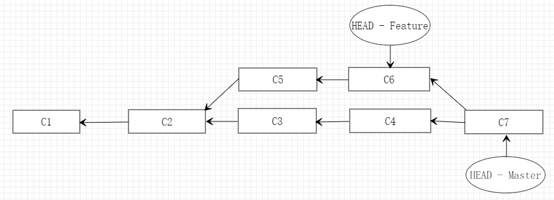
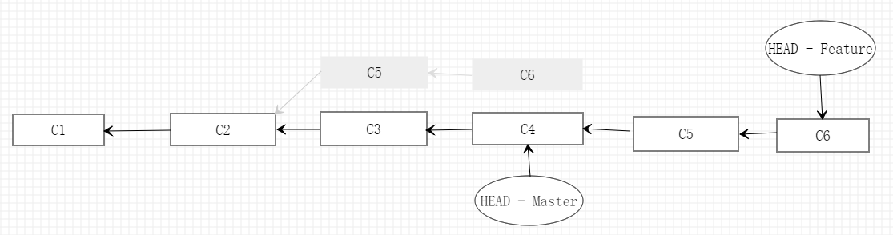

# Git 基础知识和常用操作记录

## `git status`

Git 工作目录中的文件只有两种状态：**已跟踪**和**未跟踪**

_tracked_：跟踪 _staged_：暂存 _cached_：缓存


```
git status -s 或 git status --short
用简洁的方式查看当前文件状态
```

## `git add`

- 可以开始跟踪新文件。
- 可以把已跟踪的文件放到暂存区。
- 合并时可以把有冲突的文件标记为已解决状态。
- ......

## `git diff`

```
git diff
//比较工作目录中的当前文件和暂存区域快照之间的差异

git diff --staged 或 git diff --cached
//比较已暂存文件和最后一次提交文件的差异
```

## `git commit`

```
git commit
//启动文本编辑器来输入提交说明

git commit -m <message>
//在-m后面输入提交说明

git commit -a -m <message>
//自动把所有已经跟踪过的文件暂存起来一并提交，从而跳过git add步骤

git commit --amend
//修补最后的提交，把暂存区文件提交，并可以修改最后一次的提交信息
```

## `git log`

[git log 操作指南](https://git-scm.com/book/zh/v2/Git-%E5%9F%BA%E7%A1%80-%E6%9F%A5%E7%9C%8B%E6%8F%90%E4%BA%A4%E5%8E%86%E5%8F%B2)

```
git log -p 或 git log -patch
//查看修改文件的具体变化信息

git log --stat
//查看修改文件的简略统计信息

git log -<n>
//仅显示最近的n条提交

git log --oneline
//将每个提交记录压缩在一行内显示

git log --author="<pattern>"
//搜索特定作者的提交。<pattern> 可以是字符串或正则表达式。

git log --grep="<pattern>"
//搜素匹配的特定的提交信息。<pattern> 可以是字符串或正则表达式。

git log <file>
//只显示特定文件的提交记录
```

## `git checkout`

`git checkout`有三个不同的作用：**检出文件**、**检出提交**和**检出分支**。
作用：

- 检出提交可以将项目切换到某次提交记录下，进行编译、修改、测试等操作，不需要考虑会影响到当前的状态，所做的一切**不会被保存到仓库中**。
- 检出文件是将某此提交的文件，拷贝一份放入当前的工作目录中，并将它加入缓存区。

```
git checkout master
//回到master分支

git checkout <commit> <file>
//查看文件之前的版本。它将工作目录中的 <file> 文件变成 <commit> 中那个文件的拷贝，并将它加入缓存区。

git checkout HEAD <file>
//将文件检出到最近的版本

git checkout <commit>
//使工作目录中所有的文件回到某个提交记录中
```

## `git branch`

```
git branch --merged
//过滤分支列表中已经合并到当前分支的分支（过滤出来的分支可以删掉，因为已经合并到当前分支）

git branch --no-merged
//过滤分支列表中尚未合并到当前分支的分支
```

## `git merge`

- **用途：**

  1. 用于`git pull`中，来整合另一代码仓库中的变化（即：`git pull` = `git fetch` + `git merge`）
  2. 用于从一个分支到另一个分支的合并

- **注意**：建议不要在`git merge`时存在未`commit`文件，可以使用`git stash`命令将这些未`commit`文件暂存起来，并在合并完之后使用`git stash pop`把这些未`commit`文件还原。

- **合并流程**：把两个分支最新的提交（C4 和 C6）以及二者最近的共同祖先（C2）节点进行三方合并，合并的结果生成一个新的提交（C7）。

  

```
git merge --abort
//中止合并过程，并且回到合并之前的状态

git merge <branch> --no-ff
//即使可以使用fast-forward模式，也要创建一个新的合并节点

git merge <branch> --ff-only
//只能够使用fast-forward模式，否则将拒绝合并，并返回失败状态

git merge <branch> --squash
//如果<branch>都是无意义的提交记录，可以使用--squash命令压缩为一个新的节点提交
```

[git merge 解析](https://www.jianshu.com/p/58a166f24c81)

[关于 fast forward](https://www.jianshu.com/p/b357df6794e3)

## `git rebase`

**用途：**

- 合并提交记录

- **合并分支**：找到当前分支（Feature）和目标基底（Master）分支的共同祖先（C2），并提取当前分支相对于该祖先的历次提交（C5、C6），然后将当前分支指向目标基底的最新节点（C4），最后将当前分支提取的历次提交依序应用。

  

**遵守准则**：如果提交存在于你的仓库之外，而别人可能基于这些提交进行开发，那么不要执行变基。

```
git rebase <basebranch>
//将当前分支变基到目标分支

git rebase <basebranch> <topicbranch>
//将主题分支变基到目标分支，此命令可以省去先切换分支，再执行变基命令的步骤

git rebase --onto master server client
//截取主题分支（server）上的另一个主题分支（client），然后变基到目标分支

git rebase -i HEAD~n
//修改最后n次提交
# p, pick <commit> = use commit //使用这条提交
# r, reword <commit> = use commit, but edit the commit message //使用这条提交，但修改提交信息
# e, edit <commit> = use commit, but stop for amending //使用这条提交，但修改提交的具体内容
# s, squash <commit> = use commit, but meld into previous commit //使用这条提交，但和前一条提交记录融合
# f, fixup <commit> = like "squash", but discard this commit's log message //类似squash命令，但放弃这条提交记录的提交信息
# d, drop <commit> = remove commit //删除这条提交

git rebase --skip
//跳过应用当前的提交

git rebase --abort
//中止rebase命令，并且回到之前的状态

git rebase --continue
//继续应用下一条提交
```

[Git 分支-变基](https://git-scm.com/book/zh/v2/Git-%E5%88%86%E6%94%AF-%E5%8F%98%E5%9F%BA)

[Git-重写历史](https://git-scm.com/book/zh/v2/Git-%E5%B7%A5%E5%85%B7-%E9%87%8D%E5%86%99%E5%8E%86%E5%8F%B2)

## `git reset`

**工作流程：**

1. 使用`--soft`命令，仅移动 HEAD 分支的指向。此时 Index 暂存区和工作目录的文件是最新的。
2. 默认使用`--mixed`命令，同步 Index 暂存区和 HEAD 指向提交的文件。此时工作目录的文件是最新的。
3. 使用`--hard`命令，同步工作目录和 Index 暂存区的文件。（**危险的用法，它是 Git 会真正地销毁数据的仅有的几个操作之一**）。


```
git reset HEAD~
//撤销上一次git commit命令

git reset <commit>
//将HEAD指向某个<commit>

git reset <path>
//这其实是 git reset --mixed HEAD file.txt 的简写形式，本质上只是将 file.txt 从 HEAD 复制到索引中。取消暂存文件，与git add命令正好相反
```

[Git-重置](https://git-scm.com/book/zh/v2/Git-%E5%B7%A5%E5%85%B7-%E9%87%8D%E7%BD%AE%E6%8F%AD%E5%AF%86)

## `git revert`

撤销某次提交，但会保存这次提交的`commit`和`history`，并且把这次提交作为一次新的提交。

```
git revert commit_id
```

## `git cherry-pick`

将指定的提交应用于其它分支

```
git cherry-pick <commitHashA> <commitHashB>
```

# 一些开发场景对 Git 的具体使用

## 1.刚刚提交的 commit message 写错了，如何修改？

1. 使用`git commit --amend`修改。
2. 使用`git rebase -i HEAD^`修改。

## 2.其它分支代码合并进 master 时，如何把该分支的所有提交揉合成一条提交？

1. `git merge <branch> --squash`

注：多人协作开发大型项目时，PR 的合并最好使用**Squash and merge**
[Squashing Your Pull Requests](https://cloudfour.com/thinks/squashing-your-pull-requests/#:~:text=how%20it%20helps.-,Squash%20and%20Merge,to%20edit%20the%20commit%20message.)
