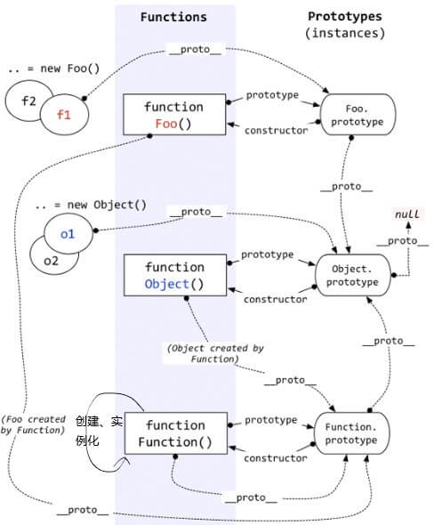

# 深入理解javascript原型和对象

## 值类型和引用类型

  - `undefined`, `number`, `string`, `boolean`, `null`属于简单**值类型**。

  - 函数、数组、对象、`new Number(10)`都是对象。他们都是**引用类型**。

  - ES6新增了一种数据类型`Symbol`，表示独一无二的值，它是 JavaScript 语言的第七种数据类型。（**对象的属性名可以有两种：一种是原来就有的字符串，另一种就是新增的 Symbol 类型。**）

    ```javascript
    let s1 = Symbol();
    let s2 = Symbol();
    let s3 = Symbol('s3');//Symbol可以接收一个字符串作为参数，表示对 Symbol 实例的描述，主要是为了在控制台显示，或者转为字符串时，比较容易区分。
    let obj = {};
    obj.s1 = 's1';//因为点运算符后面总是字符串，所以导致该属性名不是一个Symbol值，而是一个字符串
    obj[s1] = 'sym1'
    obj[s2] = 'sym2'
    obj[s3] = 'sym3'
    console.log(obj)
    
    //答案：
    s1: "s1"
    Symbol(): "sym1"
    Symbol(): "sym2"
    Symbol(s3): "sym3"
    ```

    

  - `null`是js中的一个基本数据类型,之所以显示为'object'是因为对象在底层被表示为二进制,在js中二进制前三位都为0会被判断为object类型,`null`的二进制表示全是0,自然前三位是0,所有`typeof null`会返回'object' 这是语言层面的bug。

  - 值类型的类型判断用`typeof`，引用类型的类型判断用`instanceof`。
    ```javascript
    var fn = function () { };
    console.log(fn instanceof Object);  // true
    ```
- 如何精确的区分各种数据类型

  ```javascript
  console.log(Object.prototype.toString.call("hello"));//[object String]
  console.log(Object.prototype.toString.call(123));//[object Number]
  console.log(Object.prototype.toString.call(true));//[object Boolean]
  console.log(Object.prototype.toString.call(undefined));//[object Undefined]
  console.log(Object.prototype.toString.call(null));//[object Null]
  console.log(Object.prototype.toString.call({}));//[object Object]
  console.log(Object.prototype.toString.call(function(){}));//[object Function]
  console.log(Object.prototype.toString.call([]));//[object Array]
  console.log(Object.prototype.toString.call(new Date));//[object Date]
  console.log(Object.prototype.toString.call(/\d/));//[object RegExp]
  function foo(){}
  console.log(Object.prototype.toString.call(new foo()));//[object Object]
  console.log(Object.prototype.toString.call(Symbol());//[object Symbol]
  ```

  

## 函数和对象的关系

  - **对象都是通过函数创建的**。
    ```javascript
    //js创建对象的语法糖
    //var obj = { a: 10, b: 20 };
    //var arr = [5, 'x', true];

    var obj = new Object();
    obj.a = 10;
    obj.b = 2;

    var arr = new Array();
    arr[0] = 5;
    arr[1] = 'x';
    arr[2] = true;
    ```
    
  - 每个函数function都有一个prototype，即原型。

  - 每个对象都有一个`__proto__`，即隐式原型。

  - **每个对象都有一个`__proto__`属性，指向创建该对象的函数的prototype(切记，这句话解释了原型链各种奇怪的指向！)**。

  - Object.prototype的__proto__指向的是null。

    

## instanceof
  - Instanceof的判断规则是：**沿着A的__proto__这条线来找，同时沿着B的prototype这条线来找，如果两条线能找到同一个引用，即同一个对象，那么就返回true。如果找到终点还未重合，则返回false。**(可结合上图结构查看)。
  - instanceof表示的就是一种继承关系，或者原型链的结构。
    ```javascript
    //通过以上规则，就可以解释下面这些怪异的现象了
    console.log(Object instanceof Function) //true
    console.log(Function instanceof Object) //true
    console.log(Function instanceof Function) //true
    ```

## 原型链
  - 访问一个对象的属性时，先在基本属性中查找，如果没有，再沿着`__proto__`这条链向上找，这就是原型链。
  - 通过`hasOwnProperty`来区分一个属性到底是基本的还是从原型中找到的，特别是在`for…in…`循环中，一定要注意。
    ```javascript
    function Foo() {};
    var f1 = new Foo();

    f1.a = 10;

    Foo.prototype.a = 100;
    Foo.prototype.b = 200;

    for(var item in f1) {
      console.log(item)
    }

    //a
    //b

    function Foo() {};
    var f1 = new Foo();

    f1.a = 10;

    Foo.prototype.a = 100;
    Foo.prototype.b = 200;

    for(var item in f1) {
      if(f1.hasOwnProperty(item)) {
        console.log(item)
      }
    }

    //a
    ```

## 执行上下文环境
  - 全局代码的上下文环境的三种情况。
    - 变量、函数表达式——变量声明，默认赋值为undefined（先声明变量，再声明函数表达式）；
    - this——赋值；
    - 函数声明——赋值；
     ```javascript
     console.log(a);
     var a;
     //undefined
      
     console.log(this) //Window {parent: Window, opener: null, top: Window, length: 0, frames: Window, …}
      
     console.log(f1); //function f1() {}
     function f1() {}; //函数声明
      
     console.log(f2); //undefined
     var f2 = function() {}; //函数表达式
     ```
  - 如果代码段是函数体，那么在此基础上需要附加：
    - 参数——赋值；
    - arguments——赋值；
    - 自由变量的取值作用域——赋值；
      ```javascript
      var a = 10; 
      function fn() {
        console.log(a); //a是自由变量，函数创建时，就确定了a要取值的作用域
      }; 
      function bar(f) {
        var a = 20; 
        f() //10
      }; 
      bar(fn)
      ```
  - 在本作用域中使用的变量，却没有在本作用域中声明（即在其他作用域中声明的），对本作用域来说，这个变量就是一个自由变量。
  - 函数每被调用一次，都会产生一个新的执行上下文环境，因为不同的调用可能就会有不同的参数。并且，函数在定义的时候（不是调用的时候），就已经确定了函数体内部自由变量的作用域。
  - javascript在执行一个代码段之前，都会生成执行上下文环境，这个“代码段”分三种情况——全局代码，函数体，eval代码。
  ```javascript
  //函数体是代码段是因为函数在创建时，本质上是 new Function(…) 得来的，其中需要传入一个文本形式的参数作为函数体。
  function fn(x) {
    console.log(x + 5);
  }
  //等同于：
  var fn = new Function('x', 'console.log(x + 5)');
  ```

  - 执行上下文环境通俗的定义：**在执行代码之前，把将要用到的所有的变量都事先拿出来，有的直接赋值了，有的先用undefined占个位置**。
  - 执行全局代码时，会产生一个执行上下文环境，每次调用函数都又会产生执行上下文环境。当函数调用完成时，这个上下文环境以及其中的数据都会被消除，再重新回到全局上下文环境。**处于活动状态的执行上下文环境只有一个**。其实这是一个压栈出栈的过程——执行上下文栈。
    

## this
  - **在函数中this到底取何值，是在函数真正被调用执行的时候确定的，函数定义的时候确定不了。**因为this的取值是执行上下文环境的一部分，每次调用函数，都会产生一个新的执行上下文环境。
  - `this`取值的四种情况
    1. 构造函数
        ```javascript
        //函数作为构造函数用，即new Foo()，那么其中的this就代表它即将new出来的对象。
        function Foo() {
          this.name = 'zs';
          this.age = '18';

          console.log(this); //Foo {name: "zs", age: "18"}
        }

        var f1 = new Foo();
        console.log(f1.name); //zs
        console.log(f1.age); //18

        //直接调用Foo函数，this指向Window
        function Foo() {
          this.name = 'zs';
          this.age = '18';

          console.log(this); //Window {parent: Window, postMessage: ƒ, blur: ƒ, focus: ƒ, close: ƒ, …}
        }
        Foo()

        //Fn.prototype.getName函数中，this指向的是f1对象。
        //不仅仅是构造函数的prototype，即便是在整个原型链中，this代表的也都是当前对象的值。
        function Foo() {
          this.name = 'zs';
          this.age = '18';
        }
        Foo.prototype.getName = function () {
          console.log(this.name)
        }
        var f1 = new Foo();
        f1.getName(); //'zs'
        ```
        
    2. 函数作为对象的一个属性
       ```javascript
       //作为对象的一个属性被调用时，函数中的this指向该对象
       var obj = {
         x: 10,
         fn: function () {
           console.log(this); //{x: 10, fn: ƒ}
           console.log(this.x); //10
         }
       }
        obj.fn()
     
       //不作为对象的一个属性被调用时，函数中的this指向window
       var obj = {
         x: 10,
         fn: function () {
           console.log(this); //Window {parent: Window, postMessage: ƒ, blur: ƒ, focus: ƒ, close: ƒ, …}
           console.log(this.x); //undefined
         }
       }
       var f1 = obj.fn;
       f1()
       ```
       
    3. 函数用call、apply、bind调用时，通过第一个参数指定函数内部 this 的指向。
       ```javascript
       var obj = {
         x: 10
       }
       var fn = function () {
         console.log(this); //{x: 10}
         console.log(this.x); //10
       }
       fn.call(obj)
       ```
       
    4. 全局 & 调用普通函数
      - 全局环境下，this永远是window。
        ```javascript
        console.log(this === window); //true
        ```
  - 普通函数在调用时，其中的this也都是window
        ```javascript
        var x = 10;
        
        var fn = function () {
          console.log(this); //Window {parent: Window, postMessage: ƒ, blur: ƒ, focus: ƒ, close: ƒ, …}
      console.log(this.x); //10
        }
        fn()
        
        //注意下面情况，虽然函数f是在obj.fn内部定义的，但是仍然是一个普通函数，this仍然指向window
        var obj = {
          x: 10,
          fn: function () {
            function f () {
              console.log(this); //Window {parent: Window, postMessage: ƒ, blur: ƒ, focus: ƒ, close: ƒ, …}
              console.log(this.x); //10
            }
            f()
          }
        }
        obj.fn()
        ```
## 作用域
  - javascript除了全局作用域之外，只有函数可以创建的作用域。
  - 作用域只是一个“地盘”，一个抽象的概念，其中没有变量。要通过作用域对应的执行上下文环境来获取变量的值。
  - 作用域中变量的值是在执行过程中产生的确定的，而作用域却是在函数创建时就确定了。   
  - 取自由变量的值，要到创建这个函数的那个作用域中取值，而不是“调用”。
  - **词法作用域（静态作用域）**，函数的作用域在函数定义的时候就决定了；**动态作用域**，函数的作用域是在函数调用的时候才决定的。 `JavaScript `采用的是词法作用域。
  - 当查找变量的时候，会先从当前上下文的变量对象中查找，如果没有找到，就会从父级(词法层面上的父级)执行上下文的变量对象中查找，一直找到全局上下文的变量对象，也就是全局对象。这样由多个执行上下文的变量对象构成的链表就叫做**作用域链**。
  - 作用域和执行上下文之间最大的区别是： **执行上下文在运行时确定，随时可能改变；作用域在定义时就确定，并且不会改变**。

## 闭包
  - 闭包应用的两种情况：函数作为返回值，函数作为参数传递。

## new关键字
### new做了什么？

1. 创建了一个空对象。
2. 将该空对象的隐式原型（`__proto__`）连接到构造函数的原型（`prototype`）上。
3. 执行该构造函数，并将`this`指向新创建的空对象。
4. 如果该构造函数没有返回对象，则返回新创建的对象。

### 实现一个new关键字。

```javascript
function newFun(fun, ...args) {
  var defaultObj  = Object.create(fun.prototype);
  var obj = fun.call(defaultObj, ...args);
  return obj instanceof Object ? obj : defaultObj;
}
```

## call apply和bind方法
### call 和 apply

   - 都是用来调用函数，而且是立即调用。
   - 但是可以在调用函数的同时，通过第一个参数指定函数内部 `this` 的指向。
   -	`call` 调用的时候，参数必须以参数列表的形式进行传递，也就是以逗号分隔的方式依次传递即可。
   -	`apply` 调用的时候，参数必须是一个数组，然后在执行的时候，会将数组内部的元素一个一个拿出来，与形参一一对应进行传递。
   -	如果第一个参数指定了 `null` 或者 `undefined` 则内部 `this` 指向 `window`。
### bind

   - 可以用来指定内部`this`的指向，然后生成一个改变了`this`指向的新的函数。
   - 它和`call、apply` 最大的区别是：bind不会调用。
   - `bind`支持传递参数，它的传参方式比较特殊，一共有两个位置可以传递。
      - 在`bind`执行的同时，以参数列表的形式进行传递。
      - 在返回的函数调用的时候，以参数列表的形式进行传递。
   - 两者合并：bind的时候传递的参数和调用的时候传递的参数会合并到一起，传递到函数的内部。 
   ```javascript
   function fn(sex, name) {
     console.log(this.age + '---' + sex + name);
   };
   var a = {
     age: 18
   };
   fn.call(a, 'man', 'zs'); //18---man---zs
   fn.apply(a, ['man', 'zs']); //18---man---zs
   var fn1 = fn.bind(a, 'man');
   fn1('zs') //18---man---zs
   ```

## 函数的属性
  ```javascript
  function fn (x, y, z) {
    console.log(fn.length) //形参的个数3
    console.log(arguments) //伪数组集合
    console.log(arguments.callee==fn) //函数本身true
    console.log(fn.caller) //函数的调用者 function f()
    console.log(fn.name) //函数的名字fn
  }
  function f() {
    fn(10,20,30)
  }
  f()
  ```

## 可枚举（enumerable）
  - 可枚举就是可遍历的意思，如果对象的属性可以通过`for...in`，`Object.keys()`遍历，就意味着该属性是可枚举的。新建一个对象时，定义的属性默认是可枚举的，也可以通过Object.defineProperty将该属性定义为不可枚举的。

## Class的基本语法和继承
### 基本语法

- ES6的`class`类可以看作是ES5构造函数的语法糖，它的绝大部分功能，ES5都能做到。
- `class`中的`constructor`方法是类的默认方法，通过`new`命令生成对象实例时，自动调用该方法。一个类必须有`constructor`方法，如果没有显式定义，一个空的    `constructor`方法会被默认添加。
  
  ```javascript
  class Point {
  }
   
  // 等同于
  class Point {
    constructor() {}
  }
  ```
- 类必须使用`new`调用，否则会报错。这是它跟普通构造函数的一个主要区别，后者不用new也可以执行。
  ```javascript
  class Foo {
    constructor() {
      return Object.create(null);
    }
  }
   
  Foo()
  // TypeError: Class constructor Foo cannot be invoked without 'new'
  ```
- [更多介绍请查看阮一峰老师的Class简介](http://es6.ruanyifeng.com/#docs/class#%E6%B3%A8%E6%84%8F%E7%82%B9)

### 继承

- ES5构造函数继承

  - 原型链继承
    1. 子类不能够调用父类的构造函数完成继承，而是要通过`new Father('王健林', 58)`去调用父类。
  - 类式继承（借用call、apply继承）
    1. 没有原型，无法复用一些公用函数。
  - 组合继承（原型链继承和类式继承的组合）
    1. 父级构造函数会被调用两次，一次是创建子类型原型的时候，另一次是在子类型构造函数的内部。
  - 寄生组合式继承
    1. **寄生组合式继承本质上和组合继承是一样的，但是是组合继承的优化版，在创建子类型原型的时候，它使用了一个新的函数代替了父级构造函数执行，使父级构造函数只会在子类型构造函数的内部执行一次**

  ```javascript
  //原型链继承
  function Father(name, age) {
  	this.fatherName = name;
  	this.fatherAge = age;
  }
  Father.prototype.fatherSayHi = function () {
  	console.log('hi,this is father' + this.name)
  }
  function Child(name, age) {
  	this.name = name;
  	this.age = age;
  }
  Child.prototype = new Father('王健林', 58)
  Child.prototype.constructor = Child
  Child.prototype.sayHi = function() {
  	console.log('hi,this is child' + this.name)
  }
  let child1 = new Child('王思聪', 22)
  console.dir(child1)
  
  //类式继承（借用call、apply继承）
  function Father(name, age) {
  	this.fatherName = name;
  	this.fatherAge = age;
  }
  Father.prototype.fatherSayHi = function () {
  	console.log('hi,this is father' + this.name)
  }
  function Child(name, age, fatherName, fatherAge) {
  	Father.call(this,fatherName, fatherAge)
  	this.name = name;
  	this.age = age;
  }
  Child.prototype.sayHi = function() {
  	console.log('hi,this is child' + this.name)
  }
  let child1 = new Child('王思聪', 22, '王健林', 58)
  console.dir(child1)
  
  //组合继承（原型链继承和类式继承的组合）
  function Father(name, age) {
  	this.fatherName = name;
  	this.fatherAge = age;
  }
  Father.prototype.fatherSayHi = function () {
  	console.log('hi,this is father' + this.name)
  }
  function Child(name, age, fatherName, fatherAge) {
  	Father.call(this,fatherName, fatherAge) //第二次调用
  	this.name = name;
  	this.age = age;
  }
  Child.prototype = new Father() //第一次调用
  Child.prototype.constructor = Child
  Child.prototype.sayHi = function() {
  	console.log('hi,this is child' + this.name)
  }
  let child1 = new Child('王思聪', 22, '王健林', 58)
  console.dir(child1)
  
  //寄生组合式继承
  function Father(name, age) {
  	this.fatherName = name;
  	this.fatherAge = age;
  }
  Father.prototype.fatherSayHi = function () {
  	console.log('hi,this is father' + this.name)
  }
  
  function Mather(name, age) {
  	this.matherName = name;
  	this.matherAge = age;
  }
  Mather.prototype.matherSayHi = function() {
  	console.log('hi,this is mather' + this.name)
  }
  
  function Child(name, age, arg1, arg2) {
  	Father.apply(this, arg1);
  	Mather.apply(this, arg2);
  	this.name = name;
  	this.age = age;
  }
  Child.prototype = Object.create(Father.prototype)
  Object.assign(Child.prototype, Mather.prototype)
  Child.prototype.constructor = Child
  Child.prototype.sayHi = function() {
  	console.log('hi,this is child' + this.name)
  }
  let child1 = new Child('王思聪', 22, ['王健林', 58], ['王思聪他妈', 55])
  console.dir(child1)
  ```

- ES6`class`继承
  ```javascript
  //class继承
  class Person {
    constructor(name, age, sex) {
       	this.name = name;
       	this.age = age;
       	this.sex = sex;
    }

    sayHi() {
      console.log(this.name);
    }
  }
  class Student extends Person {
  	  constructor(score, ...args) {
  		  super(...args);
  		  this.score = score;
      }
      
     exam() {
       console.log(this.name)
     }
  }
  var s1 = new Student(100, 'zs', 18, '男');
  console.dir(s1);
  ```
  
- ES5 的继承，实质是先创造子类的实例对象`this`，然后再将父类的方法添加到`this`上面（`Person.call(this, ...args)`）。ES6 的继承机制完全不同，实质是先将父类实例对象的属性和方法，加到`this`上面（所以必须先调用`super`方法），然后再用子类的构造函数修改`this`。

- 父类的静态方法也会被子类继承
  ```javascript
  class A {
    static hello() {
      console.log('hello world');
    }
  }
  class B extends A {}
  B.hello() // hello world
  ```
  
- `super`关键字
  - `super`作为函数调用时，代表父类的构造函数。
  - `super`作为对象时，在普通方法中，指向父类的原型对象；在静态方法中，指向父类。
    ```javascript
    class A {
        static say(msg) {
        	console.log('static ' + msg)
        }
        say(msg) {
        	console.log('instance ' + msg)
        }
   }
   class B extends A {
   	static fun(msg) {
   		super.say(msg)
   	}
   	fun(msg) {
   		super.say(msg)
   	}
   }
   B.fun('hi') //static hi
   let b = new B()
   b.fun('hi') //instance hi
    ```
  
 - [更多介绍请查看阮一峰老师的Class继承](http://es6.ruanyifeng.com/#docs/class-extends#%E7%AE%80%E4%BB%8B)

## 解释JS中的静态方法、公有方法、私有方法和特权方法
### 静态方法、属性

1. 不会被实例继承，而是直接通过类或构造函数调用，这就称为‘静态方法’。
2. 静态方法中的`this`指向的是类或构造函数，而不是指向的实例。
   ```javascript
     1. `Class`中的表达方式。
       class Foo {
         static name = 'zs'; //静态属性写法二
         static classMethod() { //静态方法
           return this.name;
         }
       }
       Foo.name = 'ls';//静态属性写法一
       Foo.classMethod();
       var foo = new Foo();
       foo.classMethod();
       // TypeError: foo.classMethod is not a function
   
     2. 构造函数中的表达式。
       function Foo() {}
       Foo.myName = 'zs'; //静态属性
       Foo.getName = function() { //静态方法
         return this.myName
       }
       Foo.getName()
   ```

### 公有（实例）方法、属性

  ```javascript
  1. `Class`中的表达方式。
      class Foo {
        age = 18; //公有属性写法二
        constructor() {
          this.age = 18; //公有属性写法一
        }
  
        addAge() { //公有方法
          this.age++
        }
      }
      var foo = new Foo();
      console.log(foo.age); //18
      foo.addAge();
      console.log(foo.age); //19
  
  2. 构造函数中的表达式。
      function Foo() {
        this.age = 18; //公有属性
      }
      Foo.prototype.addAge = function() { //公有方法
        this.age++
      }
      var foo = new Foo();
      console.log(foo.age); //18
      foo.addAge();
      console.log(foo.age); //19
  ```

### 私有方法、属性

1. 私有方法和私有属性，是只能在类的内部访问的方法和属性，外部不能访问。
2. `class`不支持私有方法和属性的设置，只能通过变通的方法实现，其一就是在命名前加`_`来区分。（还有几种实现方法，具体可看[Class 的基本语法](http://es6.ruanyifeng.com/#docs/class#%E7%A7%81%E6%9C%89%E6%96%B9%E6%B3%95%E5%92%8C%E7%A7%81%E6%9C%89%E5%B1%9E%E6%80%A7)）
   ```javascript
    1. `Class`中的表达方式。
        class Foo {
          _a = 1; //私有属性
          _b = 2;
          _sum() { //私有方法
            return _a + _b;
          }
        }
    
    2. 构造函数中的表达式。
        function Foo() {
          var a = 1; //私有属性
          var b = 2; //私有属性
          function sum() { //私有方法
              console.log(a + b); //3
          };
          sum()
        }
        var foo = new Foo()
   ```

  - 特权方法
    1. 特权方法可以访问私有、公有属性和方法。
       ```javascript
       function User(){
         var name = 'zs'; //私有属性
         this.age = 18; //公有属性
         this.getName = function(){ //特权方法
               return name; //name是一个自由变量，要到创建这个函数的那个作用域中取值。
         }
         this.getAge = function(){ //特权方法
               return this.age;
         }
       }
       var user = new User();
       console.log(user.getName());
       console.log(user.getAge());
       ```

# 深入理解javascript异步系列

  ### [Promise](./Promise学习这篇文章就够了.md)
