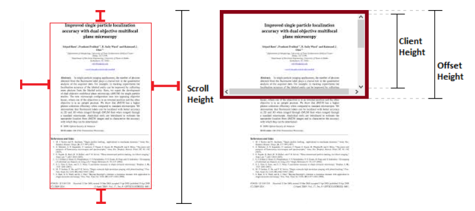
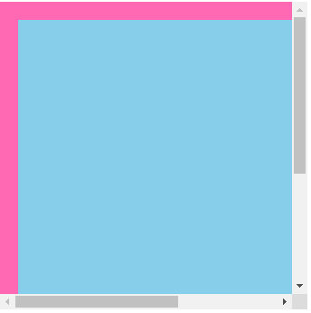
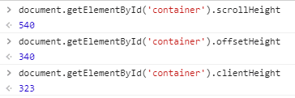
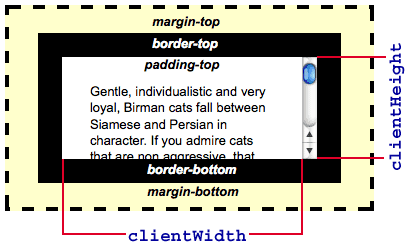
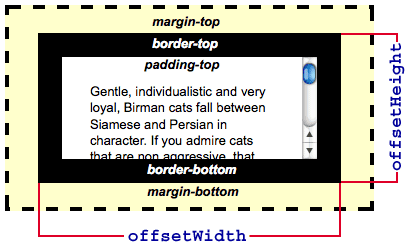
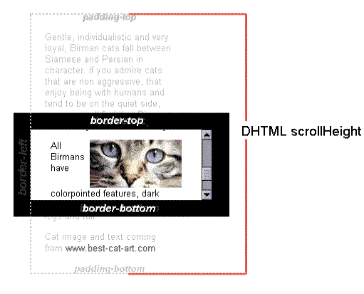

# 1.网页文档和浏览器窗口
要理解clientHeight和scrollHeight等属性，必须先知道什么是网页文档和浏览器窗口，拿下图说明：

左边的图是网页文档，包括网页未显示内容；右边红框框起来的是浏览器窗口，指的就是当前网页窗口视图。

**浏览器窗口**

``` javascript
宽：window.innerWidth
高：window.innerHeight
```
好奇的小伙伴看到innerWidth和innerHeight，就会问了是否有outerWidth和outerHeight呢，他们又有什么区别呢？innerWidth和innerHeight是不包括浏览器窗口工具栏和滚动条的，而outerWidth和outerHeight则包含。不信的小伙伴可以打开F12调试看一下。

**网页文档**

```javascript
宽：document.body.scrollWidth
高：document.body.scrollHeight
```
好了，看到这里我们就要上代码了，给大家演示一下clientHeight、offsetHeight和scrollHeight究竟有什么区别

```javascript
<!DOCTYPE html>
<html lang="en">
<head>
  <meta charset="UTF-8">
  <meta name="viewport" content="width=device-width, initial-scale=1.0">
  <meta http-equiv="X-UA-Compatible" content="ie=edge">
  <title>Document</title>
  <style>
    #container {
      width: 300px;
      height: 300px;
      background-color:hotpink;
      margin: 100px 0 0 200px;
      padding: 20px;
      overflow: auto;
    }
    #box {
      width: 500px;
      height: 500px;
      background-color: skyblue;
    }
  </style>
</head>
<body>
  <div id="container">
    <div id="box"></div>
  </div>
</body>
</html>
```
代码效果如下图：

控制台打印出：


- **scrollHeight**就是container内部的总高度 = 500(box的高度) + 40(padding的高度)。
- **offsetHeight**就是container可见高度 = 283(container的高度) + 40(padding的高度) + 0(border的宽度) + 17(滚动条的宽度)。
- **clientHeight**也是container可见高度，但是它不包括border的宽度和滚动条的宽度 = 283(container的高度) + 40(padding的高度)


# 2.属性详解
## 1.clientWidth和clientHeight
- clientHeight = CSS height + CSS padding
- 该属性只读



## 2.offsetWidth和offsetHeight
- offsetHeight = CSS height + CSS padding + CSS border + 水平滚动条高度(如果存在)
- 该属性只读



## 3.scrollWidth和scrollHeight
- scrollWidth = CSS width + CSS padding
- 该属性只读


## 4.clientTop,clientRight,clientBottom,clientLeft
- clientTop = border-top-width
- 代表元素边框宽度
- 该属性只读

## 5.offsetTop,offsetLeft
- 相对于当前元素的offsetParent元素的内边距
- 没有offsetRight和offsetBottom属性
- 该属性只读

## 6.offsetParent
- 指向包含该元素的最近的定位的元素
- 如果没有定位的元素，则 offsetParent 为最近的 table, table cell 或根元素
- 当元素的 style.display 设置为 "none" 时，offsetParent 返回 null
- 该属性只读

## 7.scrollTop,scrollLeft
- 获取和设置内容滚动的像素数
- 没有scrollRight和scrollBottom属性
- 该属性可读写

# 3.写在最后
作者水平有限，如有问题，欢迎大家指出讨论~么么哒
