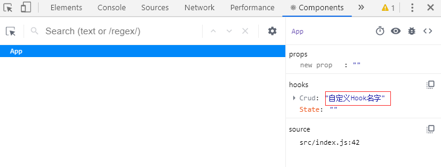

# react hooks详解

## 1.useState

1. `useState`和`this.state`的六不同

   - `useState`不会合并属性，每次更新会直接替换旧的`state`，而`this.setState`会帮我们合并属性。

   - `useState`更新时，如果与当前 state 完全相同，则不会进行重新渲染，而`this.setState`每次调用都会重新渲染。（**当`useState`更新对象时，必须要改变引用地址，不然react会认为`state`没有变化，只会替换`state`，但不会重新渲染**）

   - `useState`初始值可以接受一个函数，并且只在初始渲染时被调用，而`this.state`不行。

   - 因为`this.setState`不是立即更新`state`，所以它可以接受两个参数，第一个为要更新的`state`，第二个为更新完之后的回调函数，当然也可以使用`componentDidUpdate`来进行监听。

   - `useState`可以多次调用声明，而`this.state`只可以声明一次。

   - `useState`初始值可以是任何数据类型，而`this.state`只能是对象。

     ```javascript
     function App() {
       //初始值可以是任何类型值，并且可以接收一个函数
       let [ n, setN ] = useState(0)
       let [ m, setM ] = useState(() => {
           return {
               a: 0,
               b: 0
           }
       })
       //setN会立即更新
       const clickFunN = () => {
         setN(++n)
         console.log(n)
       }
     
       //引用地址不变，不会重新渲染，只会替换state
       function clickFunM() {
         // m.a = ++m.a
         // setM(m)
         setM((m) => { //可以接收一个函数，形参为当前state
           return { a: ++m.a }
         })
       }
       return (
         <div>
           <p>n:{n}</p>
           <p>m.a:{m.a}</p>
           <p>m.b:{m.b}</p>
           <p>
             <button onClick={clickFunN}>n</button>
             <button onClick={clickFunM}>m</button>
           </p>
         </div>
       )
     }
     ```

     

2. `useState`和`this.state`的一相同

   - `useState`返回的`setState`和`this.setState`一样可以接受一个函数当入参，但是`setState`只有一个形参，代表当前的`state`，而`this.setState`有两个形参，分表代表当前的`state`和`prop`。

3. 简单实现一个`useState`

   ```javascript
   //自定义实现useState
   let _state = []
   let _index = 0
   
   function myUseState(initalValue) {
     let currentIndex = _index;
     _index += 1;
     _state[currentIndex] = _state[currentIndex] || initalValue;
     const setState = newState => {
       _state[currentIndex] = newState;
       render()
     }
     return [_state[currentIndex], setState];
   }
   
   function render() {
     _index = 0
     ReactDOM.render(<App />, document.getElementById('root'));
   }
   ```

4. 两种情况

   ```javascript
   //第一种 
   //因为闭包原因，n会读取上一次渲染的n值，不会获取最新的n值
   import React from "react";
   import ReactDOM from "react-dom";
   const rootElement = document.getElementById("root");
   
   function App() {
     const [n, setN] = React.useState(0);
     const log = () => setTimeout(() => console.log(`n: ${n}`), 3000);
     return (
       <div className="App">
         <p>{n}</p>
         <p>
           <button onClick={() => setN(n + 1)}>+1</button>
           <button onClick={log}>log</button>
         </p>
       </div>
     );
   }
   
   ReactDOM.render(<App />, rootElement);
   
   //第二种 
   //因为闭包原因，执行两遍setN其实只是执行了最后一个setN，但如果setN入参是函数，使用形参的方式，则两遍setN都会执行。
   import React, {useState} from "react";
   import ReactDOM from "react-dom";
   
   function App() {
     const [n, setN] = useState(0)
     const onClick = ()=>{
       setN(n+1)
       setN(n+1) // 你会发现 n 不能加 2
       // setN(i=>i+1)
       // setN(i=>i+1)
     }
     return (
       <div className="App">
         <h1>n: {n}</h1>
          
         <button onClick={onClick}>+2</button>
       </div>
     );
   }
   
   const rootElement = document.getElementById("root");
   ReactDOM.render(<App />, rootElement);
   ```

   

## 2.useEffect

1. 模拟`class`组件的生命周期

   - `componentDidMount`

     ```javascript
     useEffect(() => {
         console.log('第二个参数为[]')
     }, [])
     ```

   - `componentDidUpdate`

     ```javascript
     useEffect(() => {
         console.log('没有第二个参数')
       }) //每次更行都会执行
     useEffect(() => {
         console.log('第二个参数为[n]')
     }, [n]) //n变化才会执行
     ```

   - `componentWillUnmount`

     ```javascript
     useEffect(() => {
         //组件卸载时将会执行
         return () => {
             console.log('clean 第二个参数为[]')
         }
     }, [])
     ```

2. 与`class`组件的生命周期函数的两点不同

   1. 每次更新都会依次运行`useEffect`，并且会在调用一个新的`useEffect `之前对前一个`useEffect `进行清理。

      ```javascript
      function App() {
        let [n, setN] = useState(0)
        const clickFunN = () => {
          setN(i => ++i)
        }
        useEffect(() => {
          console.log('没有第二个参数')
          return () => {
            console.log('clean 没有第二个参数')
          }
        })
        useEffect(() => {
          console.log('第二个参数为[]')
          return () => {
            console.log('clean 第二个参数为[]')
          }
        }, [])
        useEffect(() => {
          console.log('第二个参数为[n]')
          return () => {
            console.log('clean 第二个参数为[n]')
          }
        }, [n])
      
        return (
          <div>
            <p id="val">value:{n}</p>
            <p>
              <button onClick={clickFunN}>n</button>
            </p>
          </div>
        )
      }
      ```

   2. `useEffect`是在浏览器**绘制之后**执行的，而`componentDidMount`、`componentDidUpdate`是在浏览器**绘制之前**执行的，可以使用`useLayoutEffect`，它的执行时机和`componentDidMount`、`componentDidUpdate`是一样的，并且函数签名和`useEffect`一样，但是尽可能使用`useEffect` 以避免阻塞视觉更新。

      ```javascript
      //使用useEffect可以发现，页面刷新时300会出现一瞬间，而useLayoutEffect不会，因为它在浏览器绘制之前就执行了。
      function App() {
        let [n, setN] = useState(300)
      
        // useEffect(() => {
        //   document.getElementById('val').innerText = 'value:1000'
        // })
      
        useLayoutEffect(() => {
          document.getElementById('val').innerText = 'value:1000'
        })
      
        return (
          <div>
            <p id="val">value:{n}</p>
          </div>
        )
      }
      ```


## 3.useMemo和useCallback

- `useCallback`是`useMemo`的语法糖，`useCallback`直接返回目标函数，而`useMemo`要传一个函数，然后函数再返回目标函数。

- 原理都是返回一个函数，只有当依赖变化才会重新生成函数的引用。

- 如果要比较对象来优化渲染，可以使用`react.memo`的第二个参数来实现。`react.memo(component, (prevProps, nextProps) => return true || false)`

  ```javascript
  function App() {
    let [n, setN] = useState(0)
    let [m, setM] = useState(0)
  
    const setNFun = useCallback(() => {
      setN(++n)
      console.log(m)
    }, [n, m]) //如果依赖中不加m，可以发现打印的m值不会跟随更新
  
    const setMFun = useMemo(() => () => {
      setM(++m)
    }, [m])
  
    return (
      <div>
        <p id="val">父组件n：{n}</p>
        <button onClick={setNFun}>+1n</button>
        <MemoChild propFun={setMFun} m={m}/>
      </div>
    )
  }
  
  
  function Child(props) {
    console.log('子组件渲染了')
    return (
      <div>
        <p>子组件m：{props.m}</p>
        <button onClick={props.propFun}>+1m</button>
      </div>
    )
  }
  const MemoChild = React.memo(Child)
  ```


## 4.useContext

- `useContext(MyContext)` 相当于 class 组件中的 `static contextType = MyContext` 或者 `<MyContext.Consumer>`。

-  `static contextType = MyContext` 只能订阅单一的`context`，`<MyContext.Consumer>`可以使用多个`context`。

- 当`Provider `的`value`值发生变化时，它内部所有的`Consumer`组件都会更新，并且不受制于`React.memo`或 `shouldComponentUpdate`。

- 理解`context`：`context`中文译为**上下文**，在`react`应用中，数据是通过 props 属性自上而下（由父及子）进行传递的，这样有时父组件的一个属性在深层次的子组件中使用时，一层一层进行传递太过于麻烦，通过使用`context`来创建上下文，`Provider`组件来圈定作用域，作用域内部所有的组件都可以使用上下文。

  ```javascript
  const themeColor = {
    c1: 'red',
    c2: 'green',
  }
  
  //需要注意createContext的默认值只有在没有匹配到对应的Provider时才会生效
  const ThemeContext1 = React.createContext(null)
  const ThemeContext2 = React.createContext(null)
  
  class App extends React.Component {
    render() {
      return (
        <ThemeContext1.Provider value="hotpink">
          <Child1 />
        </ThemeContext1.Provider>
      )
    }
  }
  
  class Child1 extends React.Component {
    constructor(props) {
      super(props)
  
      this.changeTheme = () => {
        this.setState(state => ({
          theme: state.theme === themeColor.c1 ? themeColor.c2 : themeColor.c1
        }))
      }
      this.state = {
        theme: themeColor.c1,
        changeTheme: this.changeTheme
      }
    }
  
    render() {
      return (
        <ThemeContext2.Provider value={this.state}>
          <Child2 />
        </ThemeContext2.Provider>
      )
    }
  }
  
  //两种实现方式
  // class Child2 extends React.Component {
  //   render() {
  //     return (
  //       <ThemeContext1.Consumer>
  //         {value => (
  //           <ThemeContext2.Consumer>
  //             {({theme, changeTheme}) => (
  //               <div>
  //                 <h1 style={{ backgroundColor: value }}>ThemeContext1</h1>
  //                 <h1 style={{ backgroundColor: theme }} onClick={changeTheme}>ThemeContext2</h1>
  //               </div>
  //             )}
  //           </ThemeContext2.Consumer>
  //         )}
  //       </ThemeContext1.Consumer>
  //     )
  //   }
  // }
  
  function Child2() {
    const theme1 = useContext(ThemeContext1)
    const { theme, changeTheme } = useContext(ThemeContext2)
    return (
      <div>
        <h1 style={{ backgroundColor: theme1 }}>ThemeContext1</h1>
        <h1 style={{ backgroundColor: theme }} onClick={changeTheme}>ThemeContext2</h1>
      </div>
    )
  }
  ```


## 5.useRef

- 原理：实际就是返回一个对象，每次组件重新渲染时，它的引用地址都不变，值都赋给对象的`current`属性。

- 注意：每次`current`值发生变化时，组件并不会重新渲染，需要自己实现渲染功能。

- 为组件添加`ref`，可以直接在`class`组件上使用，但是函数组件需要通过`React.forwardRef(Component)`来进行转发。并且`ref`不通过`props`进行传递。

  ```javascript
  function App() {
    const myRef = useRef(0)
    const update = useState(0)[1] //自己实现渲染函数
  
    useEffect(() => {
      console.log(myRef)
    }, [myRef.current])
  
    return (
      <div>
        <div>current：{myRef.current}</div>
        <button onClick={() => {myRef.current++; update(Math.random())}}>+1</button>
      </div>
    )
  }
  
  //绑定DOM
  function App() {
    const myRef = useRef(0)
    useEffect(() => {
      console.log(myRef)
      myRef.current.focus()
    }, [])
    return (
      <div>
        //使用回调ref时，回调函数会执行两次，一次在组件挂载时，会调用 ref 回调函数并传入 DOM 元素，一次在卸载时调用它并传入 null
        {/* <input type="text" ref={node => myRef.current = node}/> */}
        <input type="text" ref={myRef}/>
      </div>
    )
  }
  
  //为组件添加ref
  function App() {
    const myRef = useRef(0)
  
    useEffect(() => {
      // myRef.current.childRef.current.focus() //class组件调用方式
      myRef.current.focus() //函数组件调用方式
      console.log(myRef)
    })
  
    return (
      <div>
        <Child1 ref={myRef} />
      </div>
    )
  }
  
  function Child(props, ref) {
    return (
      <div>
        <input type="text" ref={ref}/>
      </div>
    )
  }
  
  //函数组件需要通过React.forwardRef进行转发，ref单独传递
  const Child1 = React.forwardRef(Child)
  
  // class Child1 extends React.Component {
  //   constructor(props) {
  //     super(props)
  //     this.childRef = React.createRef()
  //   }
  //   render() {
  //     return (
  //       <div>
  //         <input type="text" ref={this.childRef} />
  //       </div>
  //     )
  //   }
  // }
  ```


## 6.useImperativeHandle

- `useImperativeHandle` 可以让你在使用 `ref` 时自定义暴露给父组件的实例值。

  ```javascript
  function App() {
    const ref = useRef()
  
    useEffect(() => {
      ref.current.focus()
    }, [])
  
    return <Child1 ref={ref} />
  }
  
  function Child(props, ref) {
    const myRef = useRef()
  
    useImperativeHandle(ref, () => ({
      focus: () => {
        myRef.current.focus()
      }
    }))
  
    return <input type="text" ref={myRef} />
  }
  
  const Child1 = forwardRef(Child)
  ```

  

## 7.useReducer

- 接受三个参数`useReducer(reducer, initialArg, init)`，第三个参数是一个函数，通过`init(initialArg)`来惰性求值。

  ```javascript
  //通过useReducer和useContenxt来代替redux
  function initaliStateFun(initaliState) {
    return {
      count: initaliState
    }
  }
  
  function reducer(state, action) {
    switch (action.type) {
      case 'add':
        return { count: state.count + action.number };
      case 'minus':
        return { count: state.count - action.number };
      case 'reset':
        return { count: 0 };
      default:
        return new Error('unkonw type')
    }
  }
  
  const context = React.createContext()
  
  function App() {
    const [state, dispatch] = useReducer(reducer, 0, initaliStateFun)
  
    return (
      <context.Provider value={{ state, dispatch }}>
        <div>count：{state.count}</div>
        <Child />
      </context.Provider>
    )
  }
  
  function Child() {
    const { dispatch } = useContext(context)
    const ref = useRef()
  
    return (
      <div>
        <input type="number" ref={ref} />
        <button onClick={() => dispatch({ type: 'add', number: Number(ref.current.value) })}>add</button>
        <button onClick={() => dispatch({ type: 'minus', number: Number(ref.current.value) })}>minus</button>
        <button onClick={() => { dispatch({ type: 'reset', number: 0 }); ref.current.value = '' }}>reset</button>
      </div>
    )
  }
  ```

## 8.useDebugValue

- 用于在 React 开发者工具中显示自定义 hook 的标签。

- `useDebugValue('自定义Hook名字')`，`react`开发者工具显示如下图。



## 9.自定义hook

```javascript
const list = [
  { name: 'jack', id: '1' },
  { name: 'rose', id: '2' },
  { name: 'ronaldo', id: '3' }
]

function useCrud() {
  const [state, setState] = useState(list)
  useDebugValue('CRUD', (name) => `这是改造后的${name}`)
  return {
    addFun: (name, id) => {
      setState(state.concat([{name, id}]))
    },
    deleteFun: (id) => {
      let arr = state.filter(item => item.id !== id)
      setState(arr)
    },
    state
  }
}

function App() {
  const { addFun, state, deleteFun } = useCrud()
  const [ value, setState ] = useState('')

  return (
    <div>
      姓名：<input type="text" value={value} onChange={e => setState(e.target.value) }  />
      <button onClick={() => addFun(value, Math.random())}>添加</button>
      <ul>
        {state.map(item => <div key={item.id}><li>{item.name}</li>  <button onClick={() => deleteFun(item.id)} >删除</button></div>)}
      </ul>
    </div>
  )
}
```

