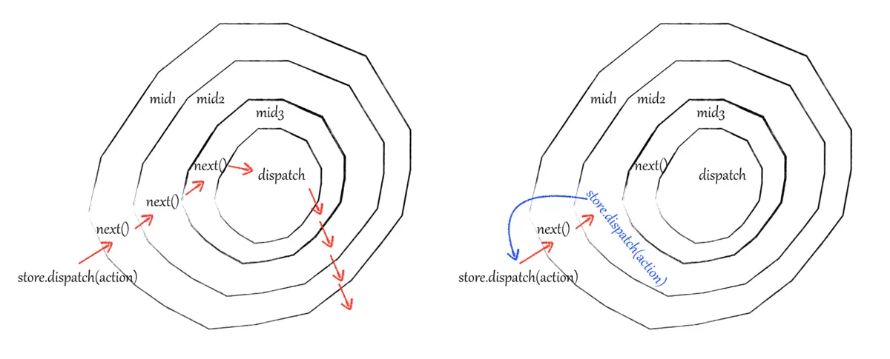

## applyMiddleware源码解读
```javascript
import compose from './compose'

export default function applyMiddleware(...middlewares) {
  return createStore => (...args) => {
    //生成store对象
    const store = createStore(...args)
    //在初始化中间件时，调用dispatch报错
    let dispatch = () => {
      throw new Error(
        'Dispatching while constructing your middleware is not allowed. ' +
          'Other middleware would not be applied to this dispatch.'
      )
    }

    //中间件传入的store参数
    const middlewareApi = {
      getState: store.getState,
      dispatch: (...arg) => dispatch(...arg)
    }
    /*
     * redux中间件函数签名为store => next => action => {...},此处相当于依次执行中间件的第一层函数，
     * 返回的数组chain中，中间件现在的状态应该是[next => action => {...}, next => action => {...}, ...]
     */
    const chain = middlewares.map(middleware => middleware(middlewareApi))
    /**
     * compose函数做的就是使函数一层套一层执行
     * compose(...chain) 返回的其实是 (...arg) => a(b(c(...arg))),
     * 这样可以看出中间件next参数代表的就是下一个中间件，如上：中间件a的next参数就是b(c(...arg))
     */
    dispatch = compose(...chain)(store.dispatch)

    /**
     * 此时返回的store对象中的dispatch方法并不是redux原生的dispatch,而是第一个中间件返回的action方法，
     * a(b(c(store.dispatch)))最内层传入的store.dispatch才是redux原生的dispatch方法，会在此处更改状态
     * 在中间件中每调用一次store.dispatch就会重新从最外层的中间件再重新执行，
     * 假如这个 middleware 一直简单粗暴地调用 store.dispatch(action)，就会形成无限循环了。
     */
    return {
      ...store,
      dispatch
    }
  }
}
```
## 中间件的执行方式
  