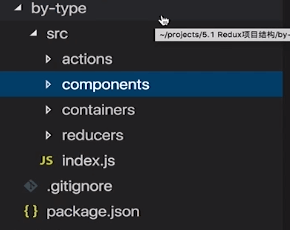
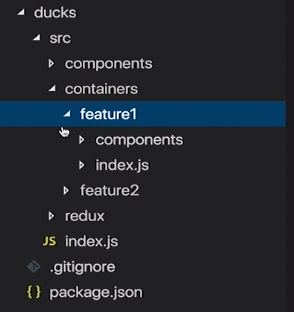

## 1.Mock数据的使用

*   方式一：代理到mock服务器
```
    1.npm install -g serve(直接在mock数据文件夹下运行serve命令)
    2.npm install http-proxy-middleware -D
    3.新建src/setupProxy.js
    const proxy = require('http-proxy-middleware');
    
    module.exports = function (app) {
     app.use(proxy('/api', { target: 'http://localhost:5000' }));
    };</pre>
```
*   直接将mock数据放到项目public文件夹(*由create-react-app创建的项目public路径下的文件不进行打包*)

## 2.组件划分原则

*   **解耦：**降低单一模块/组件的复杂度

*   **复用：**保证组件一致性，提升开发效率

*   组件颗粒度避免过大或过小

## 3\. 分析State保存位置

*   确定依赖state的每一个组件

*   如果某个state被多个组件依赖，寻找共同的父组件（状态上移）

## 4.展示型组件和容器型组件

|                    | 展示型组件（Dumb 组件）    | 容器型组件（Smart 组件）           |
| ------------------ | -------------------------- | ---------------------------------- |
| **作用**           | 描述如何展现（骨架、样式） | 描述如何运行（数据获取、状态更新） |
| **直接使用 Redux** | 否                         | 是                                 |
| **数据来源**       | props                      | 监听 Redux state                   |
| **数据修改**       | 从 props 调用回调函数      | 向 Redux 派发 actions              |
| **调用方式**       | 手动                       | 通常由 React Redux 生成            |

## 5.Redux项目结构组织方式

*   按照类型

   


*   按照功能模块

    


*   Ducks

   


## 6.Selector函数

*   实现container components层和redux层的解耦。(方便以后修改state结构)
*   简单地说就是从redux状态层中获取数据的函数。

   


## 7.Middleware中间件

*   增强store dispatch的能力。

*   function: ({ getState, dispatch }) => next => action

## 8.Store Enhancer

*   增强redux store的能力

*   createStore(reducer, [preloadedState], [enhancer])

*   middleware是store enhancer的一种

*   一般情况下尽可能的使用middleware，store enhancer可能会破坏redux原有能力。

## 9.Immutable库和Reselect库

*   Reselect会减少state的重复计算。

*   Immutable创建不可变对象，简化操作，提高效率。

## 10.路由匹配

*   使用react-router的exact属性

*   使用react提供的Switch组件

## 11.`<Route />`渲染组件方式

*   `<Route component>`

*   `<Route render>`

*   `<Route children>`

## 12.什么是领域

**领域可以理解成针对业务场景的抽象，反映业务需求的本质。例如，电商的业务场景就可以对应一个电商领域。一个领域往往会拆分为若干子领域，如电商领域可以拆分为商品，订单，用户等子领域，这里的子领域所包含的属性就是课程中所说的领域状态。可以把数据库中的一张表理解成一个领域，表中的字段就是领域状态。**

## 13.Redux调试工具安装

1.  在Chrome浏览器插件库中搜索并安装Redux DevTools插件。( [https://github.com/zalmoxisus/redux-devtools-extension](https://github.com/zalmoxisus/redux-devtools-extension) )。

 2.在createStore中使用。
   ```
import { createStore, applyMiddleware, compose } from 'redux';
    
    const composeEnhancers = window.__REDUX_DEVTOOLS_EXTENSION_COMPOSE__ || compose;
    const store = createStore(reducer, preloadedState, composeEnhancers(
     applyMiddleware(...middleware)
     ));
   ```
## 14.组件按需加载

*   使用import按路由对代码进行分片。

*   import异步加载组件会返回一个Promise对象。
```
   //引入asyncComponent
    import asyncComponent from '../../utils/asyncComponent' 
    
    const Home = asyncComponent(() => import('../Home'))
    
    //封装高阶函数asyncComponent
    import React, { Component } from 'react';
    
    export default function asyncComponent(importComponent) {
     class AsyncComponent extends Component {
     constructor(props) {
     super(props)
     this.state={
     component: null
     }
     }
    
     componentDidMount() {
     importComponent().then((mod) => {
     this.setState({
     component: mod.default
     })
     })
     }
    
     render() {
     const C = this.state.component;
     return C ? <C {...this.props} /> : null
     }
     }

     return AsyncComponent;
    }
```