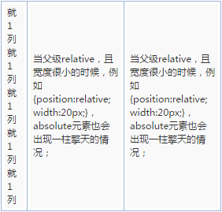
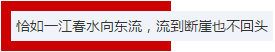
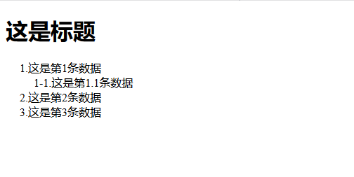
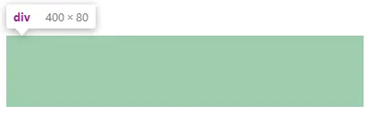
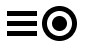
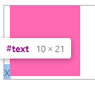

# 读书系列-《CSS世界》

## 第 1 章 概述

### 什么是“流”

**“流”又叫“文档流”，是 CSS 世界中引导元素排列和定位的一条看不见的“水流”。 **利用“流”的特性实现的“流体布局”，具有自适应性（如：使用`<div>`自上而下，使用`<span>`从左向右）。

## 第 2 章 需提前了解的术语和概念 

## 第 3 章 流、元素与基本尺寸

### 3.1  块级元素

#### 块级元素和内联元素

- 块级元素：一个水平流上只能单独显示一个元素，多个块级元素则换行显示。（如：`<div>`、`<li>`和`<table>` 等）
- 内联元素：典型特征是可以和文字在一行显示。因此，文字是内联元素，图片是内联元素，按钮是内联元素，输入框、下拉框等原生表单控件也是内联元素。（如：`<span>`、`<a>`和``等）

#### 标记盒子、外在盒子和内在盒子

- 标记盒子：**专门用来放圆点、数字这些项目符号的盒子。**`display:list-item`元素会出现项目符号就是因为生成了标记盒子，IE 浏览器下伪元素不支持 list-item或许就是无法创建这个“标记盒子”导致的。 
- 外在盒子和内在盒子：外在盒子负责元素是可以一行显示，还是只能换行显示；内在盒子（**容器盒子**）负责宽高、内容呈现等。按照 display 的属性值不同，值为 block 的元素的盒子实际由外在的“块级盒子” 和内在的“块级容器盒子”组成，值为 inline-block 的元素则由外在的“内联盒子”和内在的“块级容器盒子”组成，值为 inline 的元素则内外均是“内联盒子”。 

### 3.2  width/height 作用的具体细节

####  `width:auto` 在不同场景下的宽度表现

- **充分利用可用空间**：比方说，`<div>`、`<p>`这些元素的宽度默认是 100%于父级容器的。**CSS3**中表现为 `width:fill-available`。

  - [实际开发中的应用](https://demo.cssworld.cn/3/2-3.php)

- **收缩与包裹**：典型代表就是浮动，绝对定位，inline-block水平元素或`table`表格，英文称为“shrink-to-fit”，直译为“收缩到合适”，可理解为**“包裹性”**。**CSS3**中表现为 `width:fit-content`。

  - [实际开发中的应用](https://demo.cssworld.cn/3/2-5.php)

- **收缩到最小**：这个容易出现在 table-layout 为 auto 的表格中，当每一列空间都不够的时候，文字能断就断，但中文是随便断的，英文单词不能断。这种行为在规范中被描述为“preferred minimum width”或者“minimum content width”。**CSS3**中表现为 `width:min-content`。

  - [实际开发中的应用](https://demo.cssworld.cn/3/2-6.php)

  

- **超出容器限制**：上面1~3情况，除非有明确的`width`相关设置，否则尺寸都不会主动超过父级容器宽度的，但是存在一些特殊情况。例如，内容很长的连续的英文和数字，或者内联元素被设置了`white-space:nowrap`。子元素既保持了 inline-block 元素的收缩特性，又同时让内容宽度大，直接无视父级容器的宽度限制。**CSS3**中表现为 `width:max-content`。

  - [实际开发中的应用](https://demo.cssworld.cn/3/2-7.php)

  如下CSS代码：
  
  ```css
  .father {   
      width: 150px;   
      background-color: #cd0000;   
      white-space: nowrap; 
  } 
  .child {   
      display: inline-block;   
      background-color: #f0f3f9; 
} 
  ```

  结果：
  
  

#### 宽度分离原则

所谓“宽度分离原则”，就是 CSS 中的`width`属性不与影响宽度的padding/border（有时候包括margin）属性共存，也就是**不能出现**以下的组合：

```css
.box { width: 100px; border: 1px solid; } 
.box { width: 100px; padding: 20px; } 
```

应该`width`独立占用一层标签，而`padding`、`border`、`margin`利用流动性在内部自适应呈现：

```css
.father {
 width: 180px;
}
.son {
 margin: 0 20px;
 padding: 20px;
 border: 1px solid;
} 
```

#### `box-sizing`的作用细节

- box-sizing被直译为“盒尺寸”，实际上，其更准确的叫法应该是“盒尺寸的作用 细节”，或者说得更通俗一点，叫“width作用的细节”，也就是说，box-sizing属性的作用是改变width的作用细节。

- box-sizing被发明出来最大的初衷应该是解决替换元素宽度自适应问题，平时开发使用“宽度分离原则”更为合理。

  ```css
  input, textarea, img, video, object { /** 替换元素 **/
   box-sizing: border-box;
  } 
  ```

#### 为何`height:100%`无效

- 浏览器渲染的基本原理：先下载文档内容，加载头部的样式资源（如果有的话），然后按照从上而下、自外而内的顺序渲染 DOM 内容。
- 当渲染到父元素的时候，子元素的`width:100%`并没有渲染，宽度就是图片加文字内容的宽度；等渲染到文字这个子元素的时候， 父元素宽度已经固定，此时的 width:100%就是已经固定好的父元素的宽度。宽度不够怎么 办？溢出就好了，overflow属性就是为此而生的。（例子：[width: 100%](https://demo.cssworld.cn/3/2-10.php)）
- 为何宽度支持，高度就不支持`width:100%`呢？
  - 规范中高度的解释：如果包含块的高度没有显式指定（即高度由内容决定），并且该元素不是绝对定位，则计算值为 auto。
  - 规范中宽度的解释：如果包含块的宽度取决于该元素的宽度，那么产生的布局在 CSS 2.1 中是未定义的。

#### 如何让元素支持`height:100%`效果

- **设定显式的高度值**：宽高百分比计算是相对于content box计算的。

  ```css
  html, body {
   height: 100%;
  } 
  ```

- **使用绝对定位**：宽高百分比计算是相对于padding box的。

  ```css
  div {
   height: 100%;
   position: absolute;
  } 
  ```

### 3.3  CSS min-width/max-width 和 min-height/max-height 二三事

- max-width和max-height的初始值是 **none**；min-width和min-height的初始值是 **auto**。

- max-width会覆盖width，并且比 !important 权重还高。

  [权重大于!important](https://demo.cssworld.cn/3/3-1.php)

- min-width会覆盖max-width。

  ```css
  .container {
   	min-width: 1400px; //min-width生效
   	max-width: 1200px;
   } 
  ```

#### 任意高度元素的展开收起动画技术

- [max-height与任意高度元素滑动展开收起效果](https://demo.cssworld.cn/3/3-2.php)

### 3.4 内联元素

#### 什么是内联元素

- “内联元素”的“内联”特指“外在盒子”，inline-block和inline-table都是“内联元素”，因为它们的 “外在盒子”都是内联盒子。
- “内联元素”的典型特征就是可以和文字在一行显示。因此，文字是内联元素，图片是内联元素，按钮是内联元素，输入框、下拉框等原生表单控件也是内联元素。

#### 幽灵空白节点

在**HTML5 文档声明**中，内联元素的所有解析和渲染表现就如同每个行框盒子的前面有一个“空白节点”一样，这 个“空白节点”永远透明，不占据任何宽度，看不见也无法通过脚本获取。在规范中这是个假想盒，名叫“strut”，中文直译为“支柱”，是一个存在于每个“行框盒子”前面，同时**具有该元素的字体和行高属性的 0 宽度的内联盒**。

## 第 4 章 盒尺寸四大家族

### 4.1 深入理解 content

#### 替换元素和非替换元素

- 通过修改某个属性值呈现的内容就可以被替换的元素就称为“替换元素”（`img`、`<object>`、`<video>`、`<iframe>`、`<textarea>`、`<input>`）。
- 替换元素的特性：
  - 内容的外观不受页面上的 CSS 的影响。
  - 有自己的尺寸。如：`<video>`、`<iframe>`的默认尺寸是300像素×150 像素；``的Chrome 浏览器下默认尺寸是0像素，Firefox 浏览器下显示的是 0×22。
  - 在很多 CSS 属性上有自己的一套表现规则。

- 替换元素的尺寸从内而外分为 3 类：固有尺寸、HTML 尺寸和 CSS 尺寸；计算规则是：**固有尺寸 < HTML 尺寸 < CSS 尺寸**
  - **固有尺寸**：指替换内容原本的尺寸。例如，图片、视频作为一个独立文件存在的时候，都是有着自己的宽度和高度的，这个宽度和高度的大小就是这里的“固有尺寸”。**替换元素的固有尺寸无法改变**
  - **HTML 尺寸**：指替换元素的HTML原生属性。例如，``的 width 和 height 属性、 `<input>`的 size 属性、`<textarea>`的 cols 和 rows 属性等。
  - **CSS 尺寸**：指可以通过 CSS 的 width 和 height 或者 max-width/min-width 和 max-height/min-height 设置的尺寸，对应盒尺寸中的 content box。

- content 属性生成的对象称为“匿名替换元素”。

#### content的实际开发用处

- [content换行符与打点loading效果实例页面](https://demo.cssworld.cn/4/1-9.php)

- content 计数器和content attr属性值

  ```html
  // css
  .reset {
  	counter-reset: data;
  }
  .counter {
  	padding-left: 20px;
  }
  .counter::before{
  	content: counters(data, '-') '.';
  	counter-increment: data;
  	font-size: 16px;
  }
  
  .attr::before {
  	content: attr(data-title);
  }
  // html
  <h1 class="attr" data-title="这是标题"></h1>
    <div class="reset">
      <div class="counter">这是第1条数据
        <div class="reset">
          <div class="counter">这是第1.1条数据</div>
        </div>
      </div>
      <div class="counter">这是第2条数据</div>
      <div class="counter">这是第3条数据</div>
    </div>
  ```

  

### 4.2 温和的 padding 属性

#### padding 的百分比值

padding不可为负值，但是可以为百分比值，**padding 百分比值无论是水平方向还是垂直方向均是相对于宽度计算的。**

```css
.father {
    width: 100px;
}
.son {
    padding: 30% 50%;
    background-color: wheat;
}
```



#### padding 与图形绘制

```css
//css
.icon1 {
    display: inline-block;
    width: 30px;
    height: 5px;
    padding: 5px 0;
    border-top: 5px solid;
    border-bottom: 5px solid;
    background-clip: content-box;
    background-color: currentColor;
}
.icon2 {
    display: inline-block;
    width: 15px;
    height: 15px;
    padding: 5px;
    border-radius: 50%;
    border: 5px solid;
    background-clip: content-box;
    background-color: currentColor;
}

//html
<i class="icon1"></i>
<i class="icon2"></i>
```



### 4.3 激进的 margin 属性

#### margin 与元素的内部尺寸

元素设定了width或者保持“包裹性”的时候，padding会改变元素可视尺寸；对于margin则相反，只有元素是“充分利用可用空间”状态的时候，margin才可以改变元素的可视尺寸。

对于普通块状元素，在默认的水平流下，margin只能改变左右方向的内部尺寸，垂直方向则无法改变。如果我们使用writing-mode改变流向为垂直流，则水平方向内部尺寸无法改变，垂直方向可以改变。

```css
//css
.father {
    width: 300px;
    background-color: hotpink;
}
.son {
    margin: 10px;
    background-color: grey;
}

//html
<div class="father">
	<div class="son">aaa</div>
</div>
```

#### margin负值实现等高布局

- 优点：兼容性足够，IE6 浏览器也支持，且支持任意个分栏等高布局。（`padding-bottom:9999px`也可以用 `border-bottom: 9999px solid transparent`代替，不过 IE7 以上浏览器才支持。）
- 缺点：
  - 父级的`overflow:hidden`会阻止子元素定位到容器之外。
  - 当触发锚点定位或者使用 DOM.scrollIntoview()方法的时候，可能就会出现奇怪的定位问题。
- [margin负值实现等高布局](https://demo.cssworld.cn/4/3-2.php)

#### margin 合并

1. margin 合并的特点

   - **块级元素**，但不包括浮动和绝对定位元素，尽管浮动和绝对定位可以让元素块状化。
   - **只发生在垂直方向**，只发生在和当前文档流方向的相垂直的方向上。由于默认文档流是水平流，因此发生 margin 合并的就是垂直方向。

2. margin 合并的3种场景

   - **相邻兄弟元素 margin 合并**
   - **父级和第一个/最后一个子元素**
   - **空块级元素的 margin 合并**

3. 如何阻止 margin 合并

   - 父元素设置为块状格式化上下文元素；
   - 设置border或padding阻隔margin；
   -  用内联元素（如文字）阻隔；
   - 父元素设置 height、min-height 或 max-height。

4. margin 合并的计算规则

   “正正取大值”、“正负值相加”、“负负最负值”

#### 深入理解 CSS 中的`margin:auto`

1. `margin:auto`的填充规则

   - 如果一侧定值，一侧 auto，则 auto 为剩余空间大小。
   - 如果两侧均是 auto，则平分剩余空间。

2. 为什么`margin:auto`无法垂直居中？

   原因在于触发`margin:auto`计算有一个前提条件，就是 width 或 height 为 auto 时， 元素是具有对应方向的自动填充特性的。比方说这里，假如说把.son 元素的`height:100px`去 掉，.son 的高度会自动和父元素等高变成 200px 吗？显然不会！因此无法触发`margin:auto`计算，故而无法垂直居中。

   ```css
   .father {
       height: 200px;
   }
   .son {
       height: 100px;
       margin: auto;
   }
   ```

3. 垂直方向margin实现居中

   - 使用 writing-mode 改变文档流的方向。

     ```css
     .father {
         height: 200px;
         writing-mode: vertical-lr;
     }
     .son {
         height: 100px;
         margin: auto;
     } 
     ```

   - 格式化宽度和格式化高度

     ```css
     .father {
         width: 300px; 
         height:150px;
         position: relative; 
     }
     .son {
         position: absolute;
         top: 0; 
         right: 0; 
         bottom: 0; 
         left: 0; 
         width: 200px; 
         height: 100px; 
         margin: auto;
     }
     ```


### 4.4 功勋卓越的 border 属性

#### border-width 不支持百分比值

- margin 和 padding支持百分比，border-width不支持百分比。
- border-width 还支持关键字：
  - thin：等同于 1px。
  - medium（默认值）：等同于 3px。
  - thick：等同于 4px。

#### border-color 和 color

border-color 默认颜色就是 color 色值，具有类似特性的 CSS 属性还有 outline、box-shadow 和 text-shadow 等。

[border-color 默认颜色实际开发作用](https://demo.cssworld.cn/4/4-1.php)

#### border 与图形构建

[border生成三角形](https://codepen.io/ronaldo-c/pen/GRoOQxK)

#### border实现等高布局

[border实现等高布局](https://demo.cssworld.cn/4/4-4.php)

## 第 5 章 内联元素与流

### 5.1 字母 x—CSS 世界中隐匿的举足轻重的角色

#### 字母 x 与 CSS 世界的基线

- 字母 x 的下边缘（线）就是基线，vertical-align的默认值baseline也是基线。
- CSS 中有一个概念叫作 x-height，指的就是小写字母 x 的高度；`vertical-align:middle`指的是基线往上 1/2 x-height 高度，可以近似理解为字母 x 交叉点那个位置。
- ex 是 CSS 中的一个尺寸单位，是一个相对单位，指的是小写字母 x 的高度，就是指 x-height。
- [借助ex实现垂直居中](https://demo.cssworld.cn/5/1-1.php)

### 5.2 内联元素的基石 line-height

1. line-height的几种属性值：
   - **数值**，如`line-height:1.5`，其最终的计算结果是和当前font-size相乘后的值。
   - **百分比值**，如`line-height:150%`，其最终的计算结果是和当前font-size相乘后的值。
   - **长度值**，也就是带单位的值，如`line-height:21px`或`line-height:1.5em`，此处em是一个相对于font-size的单位，所以`line-height:1.5em`最终的计算结果也是和当前font-size相乘后的值。
2. line-height属性值继承细节不同：如果使用数值作为 line-height 的属性值， 那么所有的子元素继承的都是这个值；但是，如果使用百分比值或者长度值作为属性值，那么所有的子元素继承的是最终的计算值。

### 5.3 line-height 的好朋友 vertical-align

#### vertical-align简介

- vertical-align的属性值
  - **线类**，如 baseline（默认值）、top、middle、bottom。
  - **文本类**，如 text-top、text-bottom。
  - **上标下标类**，如 sub、super。
  - **数值百分比类**，如 20px、2em、20%等。（line-height百分比值是相对于 font-size计算的，而vertical-align 属性的百分比值则是相对于line-height的计算的）。

- vertical-align只能应用于**内联元素**以及 **display 值为table-cell**的元素。

#### img标签图片底部间隙问题

- 留白原因

  当前 line-height 计算值是 20px，而 font-size 只有 14px，因此，字母 x 往下一定 有至少 3px 的半行间距（具体大小与字体有关），而图片作为替换元素其基线是自身的下边缘。 根据定义，默认和基线（也就是这里字母 x 的下边缘）对齐，字母 x 往下的行高产生的多余的间隙就嫁祸到图片下面，让人以为是图片产生的间隙，实际上，是“幽灵空白节点”、 line-height 和 vertical-align 属性共同作用的结果。
  
  ```css
  //css
  .father {
      outline: 1px solid #aaa; 
  }
  .father > span {
      display: inline-block;
      width: 100px;
      height: 100px;
      background-color: hotpink;
  }
  
  //html
  <div class="father">
  	x<span></span>
</div>
  ```
  
  
  
- 如何清除间隙？

  - 图片块状化。
  - 容器 line-height 足够小。只要半行间距小到字母 x 的下边缘位置或者再往上，自 然就没有了撑开底部间隙高度空间了。比方说，容器设置`line-height:0`。
  - 容器 font-size 足够小。此方法要想生效，需要容器的 line-height 属性值和当 前 font-size 相关，如 line-height:1.5 或者 line-height:150%之类；否则只会让下面的间隙变得更大，因为基线位置因字符 x 变小而往上升了。
  - 图片设置其他 vertical-align 属性值。间隙的产生原因之一就是基线对齐，所以我们设置 vertical-align 的值为 top、middle、 bottom 中的任意一个都是可以的。

## 第 6 章 流的破坏与保护

### 6.1 魔鬼属性 float

### 6.2 float 的天然克星 clear

#### clear属性不能真正意义上的清除浮动

- 官方对 clear 属性的解释：元素盒子的边不能和前面的浮动元素相邻。`clear:left`就是不和左边浮动元素相邻，其它值也同理。
- clear属性只有块级元素才有效。
- `clear:both`清除浮动的缺点：
  - 如果 clear:both 元素前面的元素就是 float 元素，则 margin-top 负值即使设 成-9999px，也不见任何效果。
  - clear:both 后面的元素依旧可能会发生文字环绕的现象。

### 6.3 CSS 世界的结界——BFC 

#### BFC简介

1. BFC的定义：BFC 全称为 block formatting context，中文为“块级格式化上下文”。相对应的还有 IFC， 也就是 inline formatting context，中文为“内联格式化上下”。
2. BFC的特性：如果一个元素具有 BFC，内部子元素再怎么翻江倒海，都不会影响外部的元素。所以，BFC 元素是**不可能发生 margin 重叠的**，因为 margin 重叠是会影响外面的元素的；BFC 元素也可以用来**清除浮动的影响**，因为如果不清除，子元素浮动则父元素高度塌陷，必然会影响后面元素布局和定位，这显然有违 BFC 元素的子元素不会影响外部元素的设定。
3. 如何触发BFC：
   - `<html>`根元素；
   - float 的值不为 none；
   - overflow 的值为 auto、scroll 或 hidden；
   - display 的值为 table-cell、table-caption 和 inline-block 中的任何一个；
   - position 的值不为 relative 和 static。

### 6.4 最佳结界 overflow

### 6.5 float 的兄弟`position:absolute`

#### 无依赖 absolute 绝对定位

- absolute 是非常独立的 CSS 属性值，其样式和行为表现不依赖其他任何 CSS 属性就可以完成；一个绝对定位元素，没有任何 left/top/right/bottom 属性设置，并且其祖先元素全部都是非定位元素，其位置还是在当前位置。
- [“无依赖绝对定位”与下拉列表定位实例页面](http://demo.cssworld.cn/6/5-7.php)
- [“无依赖绝对定位”与表单实例页面](https://demo.cssworld.cn/6/5-6.php)

### 6.6 absolute 与 overflow

### 6.7 absolute 与 clip

### 6.8 absolute 的流体特性

- 当 absolute 遇到 left/top/right/bottom 属性的时候，absolute 元素才真正变成绝对定位元素，原本的相对特性丢失。如果仅设置了一个方向的绝对定位，则另一个方向依然保持了相对特性，例如：

  ```css
  //此时，水平方向绝对定位，垂直方向仍然保持相对特性
  .box {
      position: absolute;
      left: 0;
  } 
  ```

- 当一个绝对定位元素，其对立定位方向属性同时有具体定位数值的时候，流体特性就发生了。例如：

  ```css
  <div class="box"></div>
  .box {
      position: absolute;
      left: 0; right: 0;
  } 
  ```

- 利用绝对定位元素的流体特性和 margin:auto 的自动分配特性实现水平垂直居中：

  ```css
  .element {
      width: 300px; height: 200px;
      position: absolute;
      left: 0; right: 0; top: 0; bottom: 0;
      margin: auto;
  } 
  ```

### 6.9 position:relative 才是大哥

