# 读书系列-《图解HTTP》
## 第 1 章　了解 Web 及网络基础
### 1.1　使用 HTTP 协议访问 Web
Web 使用一种名为 HTTP（HyperText Transfer Protocol，超文本传输协议）的协议作为规范，完成从客户端到服务器端等一系列运作流 程。而协议是指规则的约定。可以说，**Web 是建立在 HTTP 协议上通信的。**

### 1.2　HTTP 的诞生

#### 1.2.1　为知识共享而规划 Web 

- **WWW（World Wide Web，万维网，也可简称为 Web）**这一提议是CERN（欧洲核子研究组织）的蒂姆 • 伯纳斯 - 李（Tim BernersLee） 博士提出的，致力于全世界的研究者们进行知识共享。

- WWW的构建技术：
  - 作为页面的文本标记语言的 **HTML**（HyperText Markup Language，超文本标记语言）； 
  - 作为文档传递协议的 **HTTP** ；
  - 指定文档所在地址的 **URL**（Uniform Resource Locator，统一资源定位符）

#### 1.2.2　Web 成长时代 

#### 1.2.3　驻足不前的 HTTP 

- **HTTP/0.9**：HTTP 于 1990 年问世，那时的 HTTP 并没有作为正式的标准被建立， 因此被称为 HTTP/0.9。 
- **HTTP/1.0 **：HTTP 正式作为标准被公布是在 1996 年的 5 月。
- **HTTP/1.1**：1997 年 1 月公布的 HTTP/1.1 是目前主流的 HTTP 协议版本。

### 1.3　网络基础 TCP/IP

#### 1.3.1　TCP/IP 协议族

- 计算机与网络设备要相互通信，双方就必须基于相同的方法，不同的硬件、操作系统之间的通信都需要一种规则。而我们就把这种规则称为 协议（protocol）。

- **TCP/IP 是互联网相关的各类协议族的总称 。**

#### 1.3.2　TCP/IP 的分层管理

TCP/IP 协议族按层次分别分为以下 4 层：

- **应用层**：应用层决定了向用户提供应用服务时通信的活动。比如：FTP（File Transfer Protocol，文件传输协议）和 DNS（Domain Name System，域名系统）服务，HTTP 协议也处于该层。
- **传输层**：传输层对上层应用层，提供处于网络连接中的两台计算机之间的数据传输。比如：TCP（Transmission Control Protocol，传输控制协议）和 UDP（User Data Protocol，用户数据报协议）。
- **网络层（又名网络互连层**）：网络层用来处理在网络上流动的数据包。数据包是网络传输的最小数据单位。该层规定了通过怎样的路径（所谓的传输路线）到达对方计算机，并把数据包传送给对方。
- **链路层（又名数据链路层，网络接口层）**：用来处理连接网络的硬件部分。包括控制操作系统、硬件的设备驱 动、NIC（Network Interface Card，网络适配器，即网卡），及光纤等物理可见部分（还包括连接器等一切传输媒介）。

#### 1.3.3　TCP/IP 通信传输流

- 利用 TCP/IP 协议族进行网络通信时，会通过分层顺序与对方进行通信。发送端从应用层往下走，接收端则往应用层往上走。

- 发送端在层与层之间传输数据时，每经过一层时必定会被打上一个该层所属的首部信息。反之，接收端在层与层传输数据时，每经过一层时会把对应的首部消去。这种把数据信息包装起来的做法称为封装（encapsulate）。（下图以HTTP请求为例）

  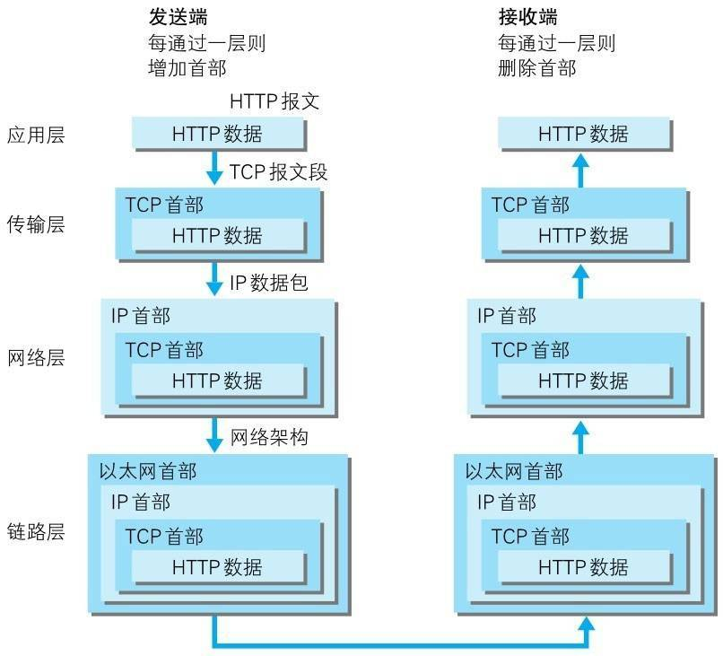

### 1.4　与 HTTP 关系密切的协议 : IP、TCP 和 DNS

#### 1.4.1　负责传输的 IP 协议

- IP（Internet Protocol）网际协议位于网络层。（**IP**和**IP地址**不同，IP其实是一种协议名称）。
- IP 协议的作用是把各种数据包传送给对方。而要保证确实传送到对方 那里，则需要满足各类条件。其中两个重要的条件是**IP 地址**和**MAC 地址**（Media Access Control Address）。 

- IP 间的通信依赖 MAC 地址。在网络上，通信的双方在同一局域网 （LAN）内的情况是很少的，通常是经过多台计算机和网络设备中转才能连接到对方。而在进行中转时，会利用下一站中转设备的 MAC 地址来搜索下一个中转目标。这时，会采用 ARP 协议（Address Resolution Protocol）。ARP 是一种用以解析地址的协议，根据通信方 的 IP 地址就可以反查出对应的 MAC 地址。（类似于快递公司送货，通过层层集散中心，最终到达客户手中）

#### 1.4.2　确保可靠性的 TCP 协议 

- TCP协议位于传输层，为了更容易传送大数据把数据分割，并且TCP 协议能够确认数据最终是否送达到对方。

- 为了准确无误地将数据送达目标处，TCP 协议采用了三次握手 （three-way handshaking）策略。若在握手过程中某个阶段莫名中断，TCP 协议会再次以相同的顺序发送相同的数据包。

  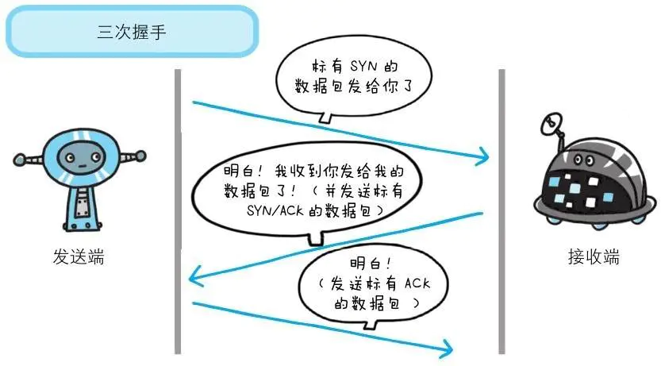

### 1.5　负责域名解析的 DNS 服务

- DNS（Domain Name System）服务是和 HTTP 协议一样位于应用层的协议。**DNS 协议提供通过域名查找 IP 地址，或逆向从 IP 地址反查域名的服务。**

  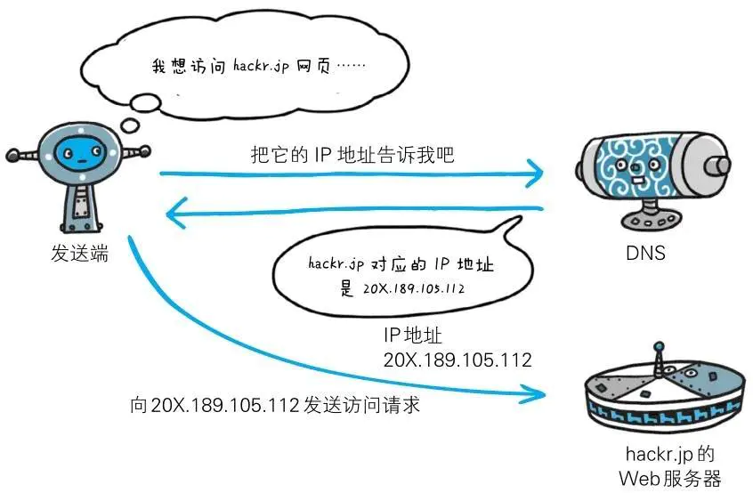

### 1.6　各种协议与 HTTP 协议的关系

-  IP 协议、TCP 协议和 DNS 服务在使用 HTTP 协议的通信过程中各自发挥的作用

  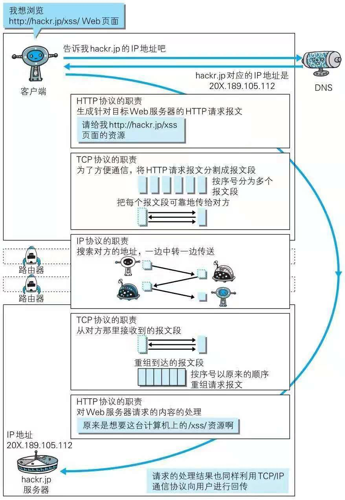

### 1.7　URI 和 URL

- URI（Uniform Resource Identifier ，统一资源标识符）。
- URL（Uniform Resource Locator，统一资源定位符）。

#### 1.7.1　统一资源标识符 

- URI 用字符串标识某一互联网资源，而 URL 表示资源的地点（互联网上所处的位置）。可见 URL 是 URI 的子集。 

#### 1.7.2　URI 格式 

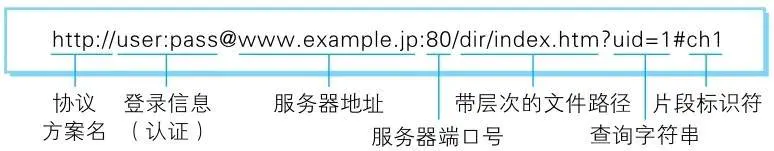

## 第 2 章　简单的 HTTP 协议

### 2.1　HTTP 协议用于客户端和服务器端之间的通信

- 请求访问文本或图像等资源的一端称为客户端，而提供资源响应的一端称为服务器端。
- 在两台计算机之间使用 HTTP 协议通信时，在一条通信线路上必定有一端是客户端，另一端则是服务器端。

### 2.2　通过请求和响应的交换达成通信

- **请求报文**是由请求方法、请求 URI、协议版本、可选的请求首部字段和内容实体构成的。
- **响应报文**基本上由协议版本、状态码（表示请求成功或失败的数字代码）、用以解释状态码的原因短语、可选的响应首部字段以及实体主体构成。

### 2.3　HTTP 是不保存状态的协议

HTTP 是一种不保存状态，即**无状态（stateless）协议**。

- 优点：更快地处理大量事务，确保协议的可伸缩性。
- 缺点：无法实现保持状态功能（引入了 Cookie 技术）。

### 2.4　请求 URI 定位资源

- HTTP 协议使用 URI 定位互联网上的资源，当客户端请求访问资源而发送请求时，URI 需要被作为请求报文中的请求 URI 包含在内。

### 2.5　告知服务器意图的 HTTP 方法

### 2.6　使用方法下达命令

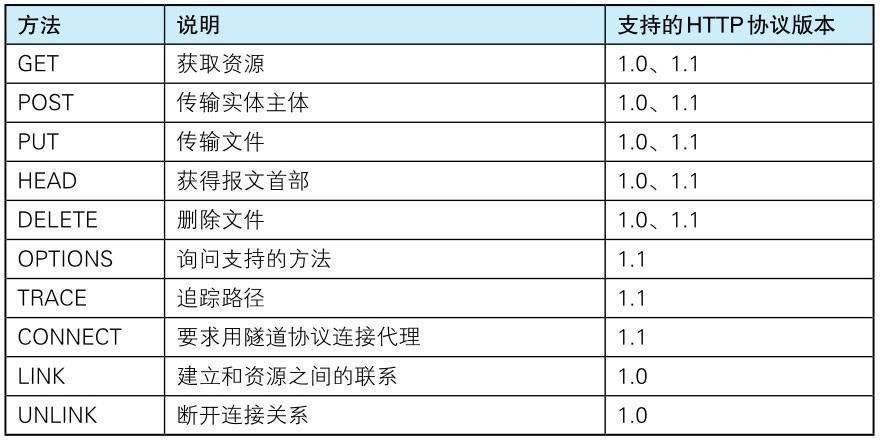

### 2.7　持久连接节省通信量

HTTP 协议的初始版本中，每进行一次 HTTP 通信就要断开一次 TCP 连接，可随着 HTTP 的普及，文档中包含大量图片的情况多了起来，每次的请求都会造成无谓的 TCP 连接建立和断开，**增加通信量的开销**。

#### 2.7.1　持久连接 

- 简介：在 HTTP/1.1 中，所有的连接默认都是持久连接（HTTP Persistent Connections，也称为 HTTP keep-alive 或 HTTP connection reuse），但在 HTTP/1.0 内并未标准化。
- 特点：只要任意一端没有明确提出断开连接，则保持 TCP 连接状态。
- 好处：减少了 TCP 连接的重复建立和断开所造成的额外开销，减轻了服务器端的负载，使 HTTP 请求和响应能够更早地结束，这样 Web 页面的显示速度也就相应提高了。

#### 2.7.2　管线化

管线化技术（pipelining）能够做到同时并行发送多个请求，而不需要一个接一个地等待响应。

### 2.8　使用 Cookie 的状态管理

- HTTP 是无状态协议，无法根据之前的状态进行本次的请求处理。于是Cookie 技术通过在请求和响应报文中写入 Cookie 信息来控制客户端的状态。

- Cookie 会根据从服务器端发送的响应报文内的一个叫做 **Set-Cookie **的 首部字段信息，通知客户端保存 Cookie。当下次客户端再往该服务器发送请求时，客户端会自动在请求报文中加入Cookie 值后发送出去。
  服务器端发现客户端发送过来的 Cookie 后，会去检查究竟是从哪一 个客户端发来的连接请求，然后对比服务器上的记录，最后得到之前的状态信息。

  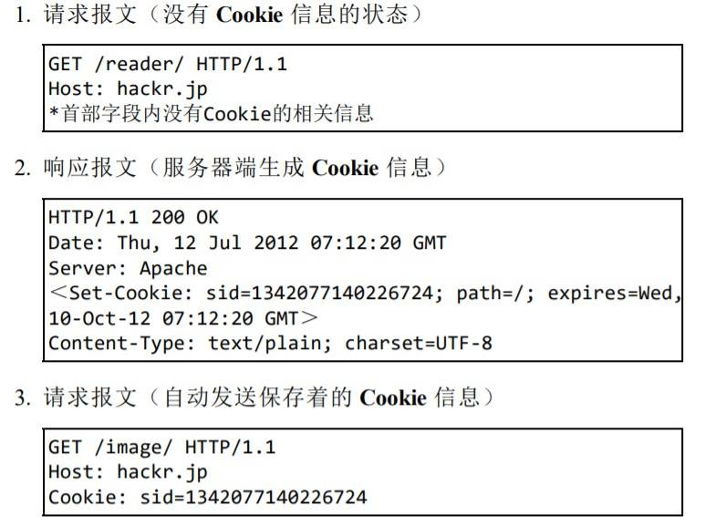

## 第 3 章　HTTP 报文内的 HTTP 信息

### 3.1　HTTP 报文

- **什么是 HTTP 报文：**用于 HTTP 协议交互的信息被称为 HTTP 报文。请求端（客户端）的 HTTP 报文叫做请求报文，响应端（服务器端）的叫做响应报文。 
- **HTTP 报文的构成：**HTTP 报文大致可分为报文首部和报文主体两块，通常，并不一定要有报文主体。

### 3.2　请求报文及响应报文的结构

- 请求报文结构：报文首部（请求行、请求首部字段、通用首部字段、实体首部字段、其它）、空行（CR+LF）、报文主体
- 返回报文结构：报文首部（状态行、响应首部字段、通用首部字段、实体首部字段、其它）、空行（CR+LF）、报文主体

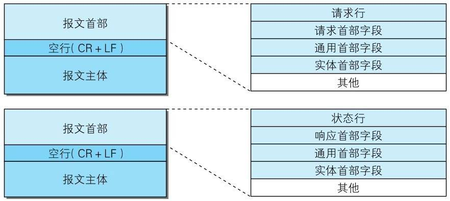

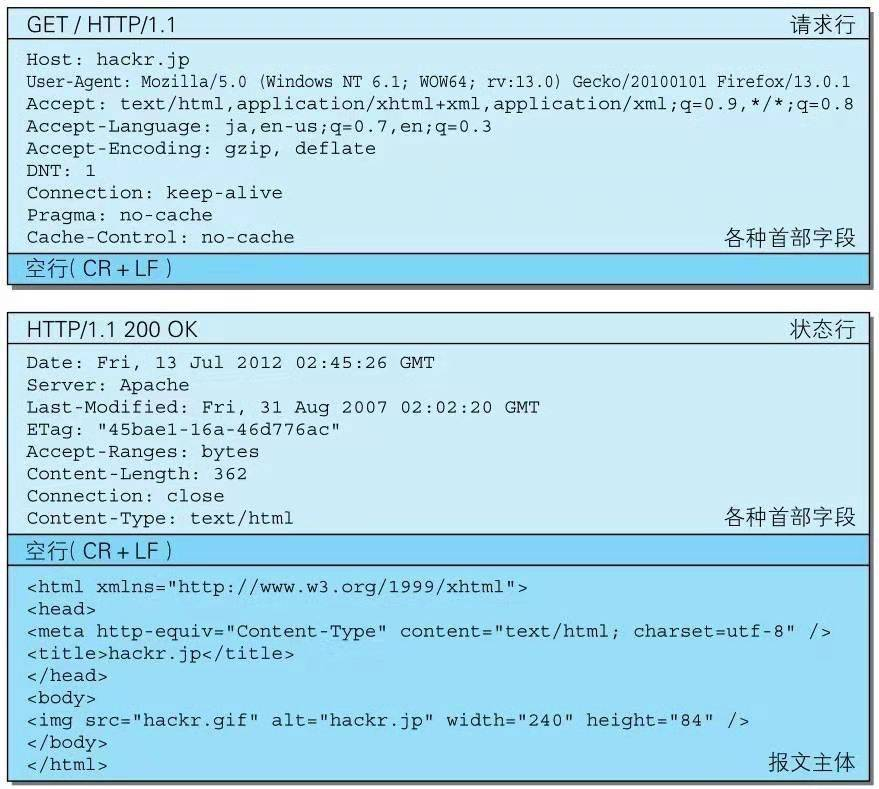

### 3.3　编码提升传输速率

- HTTP 在传输数据时可以按照数据原貌直接传输，但也可以在传输过程中通过编码提升传输速率。
- 通过在传输时编码，能有效地处理大量的访问请求。但也会消耗更多 的 CPU 等资源。 

#### 3.3.1　报文主体和实体主体的差异

- 报文（message）：是 **HTTP 通信中的基本单位**，由 8 位组字节流（octet sequence， 其中 octet 为 8 个比特）组成，通过 HTTP 通信传输。 
- 实体（entity）：作为请求或响应的有效载荷数据（补充项）被传输，其内容由**实体首部**和**实体主体**组成。

#### 3.3.2　压缩传输的内容编码 

- HTTP协议中的内容编码指明应用在实体内容上的编码格式，并保持实体信息原样压缩。内容编码后的实体由客户端接收并负责解码。

- 常用的内容编码：gzip（GNU zip） 、compress（UNIX 系统的标准压缩） 、deflate（zlib） 、identity（不进行编码） 。

#### 3.3.3　分割发送的分块传输编码 

在 HTTP 通信过程中，请求的编码实体资源尚未全部传输完成之前， 浏览器无法显示请求页面。在传输大容量数据时，通过把数据分割成多块，能够让浏览器逐步显示页面。这种把实体主体分块的功能称为**分块传输编码**（Chunked Transfer Coding）。

### 3.4　发送多种数据的多部分对象集合

HTTP 协议中采纳了多部分对象集合，也就是发送的一份报文主体内可含有多类型实体。通常是在图片或文本文件等上传时使用。

### 3.5　获取部分内容的范围请求

- 指定范围发送的请求叫做范围请求（Range Request）。 
- 执行范围请求时，通过首部字段 Range 来指定资源的 byte 范围。 

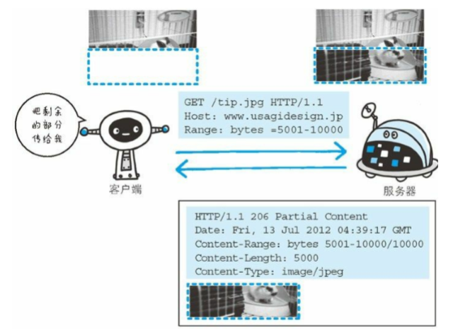

### 3.6　内容协商返回最合适的内容

内容协商机制是指客户端和服务器端就响应的资源内容进行交涉，然后提供给客户端最为适合的资源。内容协商会以响应资源的语言、字符集、编码方式等作为判断的基准。

内容协商技术有以下 3 种类型：

- 服务器驱动协商（Server-driven Negotiation）
- 客户端驱动协商（Agent-driven Negotiation）
- 透明协商（Transparent Negotiation）

## 第 4 章　返回结果的 HTTP 状态 码

### 4.1　状态码告知从服务器端返回的请求结果

状态码以 3 位数字和原因短语组成，第一位指定了响应类别，后两位无分类；状态码有以下五种分类：

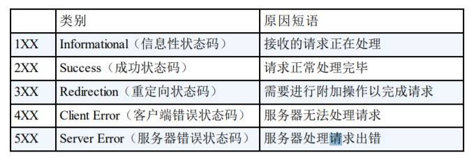

### 4.2　2XX 成功

#### 4.2.1　200 OK

表示从客户端发来的请求在服务器端被正常处理了。

#### 4.2.2　204 No Content

该状态码代表服务器接收的请求已成功处理，但在返回的响应报文中不含实体的主体部分。另外，也不允许返回任何实体的主体。

#### 4.2.3　206 Partial Content

该状态码表示客户端进行了范围请求，而服务器成功执行了这部分的 GET 请求。响应报文中包含由 Content-Range 指定范围的实体内容。 

### 4.3　3XX 重定向

#### 4.3.1　301 Moved Permanently

永久性重定向。该状态码表示请求的资源已被分配了新的URI，以后应使用资源现在所指的 URI。

#### 4.3.2　302 Found

临时性重定向。该状态码表示请求的资源已被分配了新的 URI，希望用户（本次）能使用新的 URI 访问。 

#### 4.3.3　303 See Other

- 该状态码表示由于请求对应的资源存在着另一个 URI，应使用 GET 方法定向获取请求的资源。（与302 Found 状态码有着相同的功能，但 303 状态码明确表示**客户端应当采用 GET 方法**获取资源。）
- 当 301、302、303 响应状态码返回时，几乎所有的浏览器都会把 POST 改成 GET，并删除请求报文内的主体，之后请求会自动再次发送；301、302 标准是禁止将 POST 方法改变成 GET 方法的，但实际使用时大家都会这么做。

#### 4.3.4　304 Not Modified

该状态码表示客户端发送附带条件的请求（*采用 GET 方法的请求报文中包含 If-Match，If-ModifiedSince，If-None-Match，If-Range，If-Unmodified-Since 中任一首部*）时，服务器端允许请求访问资源，但未满足条件的情况。304 状态码返回时，不包含任何响应的主体部分。

#### 4.3.5　307 Temporary Redirect 

临时重定向。该状态码与 302 Found 有着相同的含义。

### 4.4　4XX 客户端错误

#### 4.4.1　400 Bad Request

该状态码表示请求报文中存在语法错误。（浏览器会像 200 OK 一样对待该状态码。）

#### 4.4.2　401 Unauthorized

该状态码表示发送的请求需要有通过 HTTP 认证（BASIC 认证、 DIGEST 认证）的认证信息。若之前已进行过1次请求，则表示用户认证失败。 

#### 4.4.3　403 Forbidden

该状态码表明对请求资源的访问被服务器拒绝了。

#### 4.4.4　404 Not Found

该状态码表明服务器上无法找到请求的资源。

### 4.5　5XX 服务器错误

#### 4.5.1　500 Internal Server Error

该状态码表明服务器端在执行请求时发生了错误。

#### 4.5.2　503 Service Unavailable

该状态码表明服务器暂时处于超负载或正在进行停机维护，现在无法处理请求。

## 第 5 章　与 HTTP 协作的 Web 服务器

### 5.1　用单台虚拟主机实现多个域名

在相同的 IP 地址下，由于虚拟主机可以寄存多个不同主机名和域名 的 Web 网站，因此在发送 HTTP 请求时，必须在 Host 首部内完整指定主机名或域名的 URI。 

### 5.2　通信数据转发程序 ：代理、网关、隧 道

- 代理：代理是一种有转发功能的应用程序，它扮演了位于服务器和客户端“中间人”的角色，接收由客户端发送的请求并转发给服务器，同时也接收服务器返回的响应并转发给客户端。
- 网关：网关是转发其他服务器通信数据的服务器，接收从客户端发送来的请 求时，它就像自己拥有资源的源服务器一样对请求进行处理。有时客户端可能都不会察觉，自己的通信目标是一个网关。
- 隧道：隧道是在相隔甚远的客户端和服务器两者之间进行中转，并保持双方通信连接的应用程序。

#### 5.2.1　代理

- 代理服务器的基本行为：接收客户端发送的请求后转发给其他服务器。代理不改变请求 URI，会直接发送给前方持有资源的目标服务器。
- 使用代理服务器的理由：利用缓存技术减少网络带宽的流量，组织内部针对特定网站的访问控制，以获取访问日志为主要目的，等等。
- 代理使用分类：按两种基准分类。一种是是否使用缓存，另一 种是是否会修改报文。
  - **缓存代理**：代理转发响应时，缓存代理（Caching Proxy）会预先将资源的副本（缓存）保存在代理服务器上。当代理再次接收到对相同资源的请求时，就可以不从源服务器那里获取资源，而是将之前缓存的资源作为响应返回。
  - **透明代理**：转发请求或响应时，不对报文做任何加工的代理类型被称为透明代理 （Transparent Proxy）。反之，对报文内容进行加工的代理被称为非透明代理。

- 每次通过代理服务器转发请求或响应时，会追加写入 Via 首部信息。

  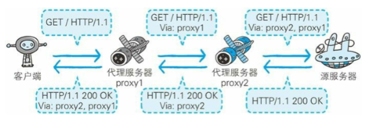

#### 5.2.2　网关

- 网关的作用：利用网关能提高通信的安全性，因为可以在客户端与网关之间的通信线路上加密以确保连接的安全。

- 网关的机制：网关的工作机制和代理十分相似。而网关能使通信线路上的服务器**提供非 HTTP 协议服务**，利用网关可以由 HTTP 请求转化为其他协议通信。

  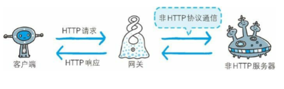

#### 5.2.3　隧道 

隧道可按要求建立起一条与其他服务器的通信线路，届时使用 SSL 等加密手段进行通信。隧道的目的是确保客户端能与服务器进行安全的通信。

### 5.3　保存资源的缓存

缓存是指代理服务器或客户端本地磁盘内保存的资源副本。利用缓存可减少对源服务器的访问，因此也就节省了通信流量和通信时间

#### 5.3.1　缓存的有效期限

即使存在缓存，也会因为客户端的要求、缓存的有效期等因素，向源服务器确认资源的有效性。若判断缓存失效，缓存服务器将会再次从源服务器上获取“新”资源。

#### 5.3.2　客户端的缓存

- 浏览器缓存如果有效，就不必再向服务器请求相同的资源了，可以直 接从本地磁盘内读取。
- 缓存服务器相同的一点是，当判定缓存过期后，会向源服务器确认资源的有效性。若判断浏览器缓存失效，浏览器会再次请求新资源。

## 第 6 章　HTTP 首部

### 6.1　HTTP 报文首部

HTTP 协议的请求和响应报文中必定包含 HTTP 首部。首部内容为客户端和服务器分别处理请求和响应提供所需要的信息。

### 6.2　HTTP 首部字段 

#### 6.2.1　HTTP 首部字段传递重要信息 

#### 6.2.2　HTTP 首部字段结构 

HTTP 首部字段是由首部字段名和字段值构成的，中间用冒号“:” 分 隔。

#### 6.2.3　4 种 HTTP 首部字段类型

HTTP 首部字段根据实际用途被分为以下 4 种类型：

- 通用首部字段（General Header Fields）：请求报文和响应报文两方都会使用的首部。
- 请求首部字段（Request Header Fields）：从客户端向服务器端发送请求报文时使用的首部。
- 响应首部字段（Response Header Fields）：从服务器端向客户端返回响应报文时使用的首部。
- 实体首部字段（Entity Header Fields）：针对请求报文和响应报文的实体部分使用的首部。

#### 6.2.4　HTTP/1.1 首部字段一览

HTTP/1.1 规范定义了如下 47 种首部字段：

- 通用首部字段

  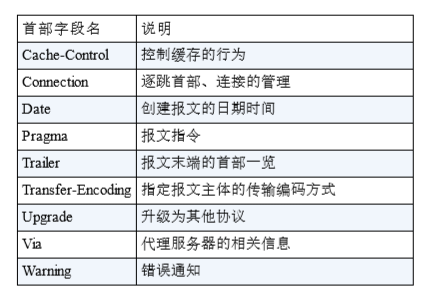

- 请求首部字段

  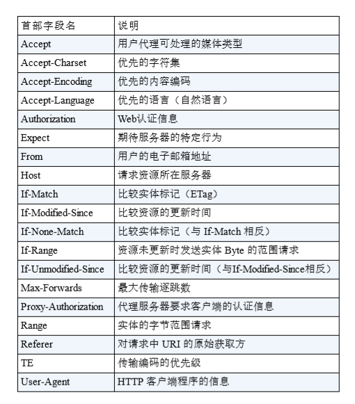

- 响应首部字段

  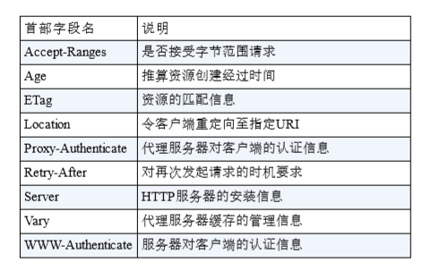

- 实体首部字段

  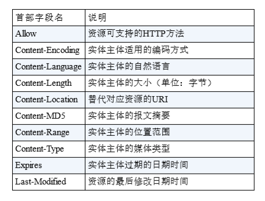

#### 6.2.5　非 HTTP/1.1 首部字段 

在 HTTP 协议通信交互中使用到的首部字段，不限于 RFC2616 中定 义的 47 种首部字段。还有 Cookie、Set-Cookie 和 Content-Disposition 等在其他 RFC 中定义的首部字段，它们的使用频率也很高。 这些非正式的首部字段统一归纳在 RFC4229 HTTP Header Field Registrations 中。 

## 第 7 章　确保 Web 安全的 HTTPS

### 7.1　HTTP 的缺点

- 通信使用明文（不加密），内容可能会被窃听。
- 不验证通信方的身份，因此有可能遭遇伪装。
- 无法证明报文的完整性，所以有可能已遭篡改。

### 7.2　HTTP+ 加密 + 认证 + 完整性保护 =HTTPS 

#### 7.2.1　HTTP 加上加密处理和认证以及完整性保护后即是 HTTPS 

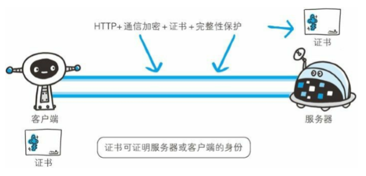

#### 7.2.2　HTTPS 是身披 SSL 外壳的 HTTP

- HTTPS 并非是应用层的一种新协议。

- 通常，HTTP 直接和 TCP 通信。当使用 SSL 时，则演变成先和 SSL 通信，再由 SSL 和 TCP 通信了。

- SSL 是独立于 HTTP 的协议，所以不光是 HTTP 协议，其他运行在应 用层的 SMTP 和 Telnet 等协议均可配合 SSL 协议使用。

  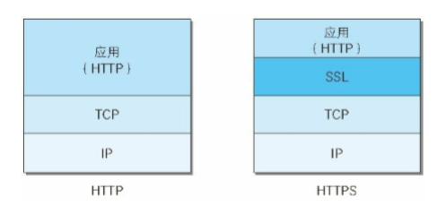

  ## 第 8 章　确认访问用户身份的认证

  ## 第 9 章　基于 HTTP 的功能追加协议

  ## 第 10 章　构建 Web 内容的技术

  ## 第 11 章　Web 的攻击技术
  
  