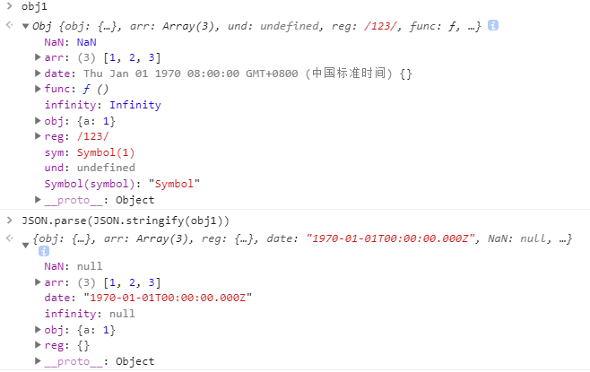

## CSS系列

### 1.居中的几种方法

- 自身设置相对定位实现居中

  ``` css
  .content {
        width: 600px;
        height: 600px;
        border: 1px solid #cccccc;
  }
  .box {
        background-color: skyblue;
        width: 200px;
        height: 200px;
        position: relative;
        top: 50%;
        margin: 0 auto;
        /* margin-top: 100px; */
        transform: translateY(-50%);
  }
  ```

- 子绝父相实现居中

  ```css
  .content {
        width: 600px;
        height: 600px;
        border: 1px solid #cccccc;
        position: relative;
  }
  .box {
        background-color: skyblue;
        width: 200px;
        height: 200px;
        position: absolute;
        top: 0;
        left: 0;
        bottom: 0;
        right: 0;
        margin: auto;
        /* top: 50%;
        left: 50%;
        transform: translate(-50%, -50%); */
  }
  ```

- flex布局实现居中

  ```css
  .content {
        width: 600px;
        height: 600px;
        border: 1px solid #cccccc;
        display: flex;
        justify-content: center;
        align-items: center;
  }
  .box {
        background-color: skyblue;
        width: 200px;
        height: 200px;
  }
  ```

### 2.盒模型

- 标准盒模型：width和height指的是**content**

- IE盒模型：width和height指的是**content+border+padding**

- 如何设置两种盒模型

  ```
  /* 设置当前盒子为 标准盒模型（默认） */
  box-sizing: content-box;
  
  /* 设置当前盒子为 IE盒模型 */
  box-sizing: border-box;
  ```

### 3.BFC（块级格式化上下文）

BFC（CSS世界的结界）

- 内部子元素的任何操作都不会影响到外部的元素。
- BFC 元素是不可能发生`margin`重叠的，因为`margin` 重叠是会影响外面的元素的。
- BFC 元素也可以用来清除浮动的影响，因为如果不清除，子元素 浮动则父元素高度塌陷，必然会影响后面元素布局和定位，这显然有违 BFC 元素的子元素不会 影响外部元素的设定。 

如何生成BFC

- `<html>`根元素。
- `float`的值不为`none`。
- `overflow`的值为`auto`、`scroll`或`hidden`。
- `display`的值为`table-cell`、`table-caption`和`inline-block`中的任何一个。
- `position`的值不为`relative`和`static`

### 4.em和rem

- em是相对于使用em单位的元素的字体大小，因为子元素可以继承父元素的`font-size`，所以父元素可以影响子元素的em大小，一旦子元素设置显式的`font-size`，那么子元素的em大小，就是基于本身的`font-size`

- 根 html 元素将继承浏览器中设置的字体大小，除非显式设置固定值去覆盖，而rem的值是基于html元素的`font-size`

  ```css
  html {
      font-size: 30px;
  }
  .box {
      font-size: 16px;
      padding: 1rem; //30px
  }
  .content {
      font-size: 20px;
      padding: 2em; //40px
  }
  
  <div class="box">
  	<div class="content"></div>
  </div>
  ```

- rem与px的换算方式

  - 媒体查询
  - 通过屏幕宽度或者dpr进行换算

- dpr：设置像素比 = 物理像素 / 逻辑像素(px)   Ps:在某一方向上，x方向或者y方向

### 5.position

```javascript
position: static | relative | absolute | fixed | sticky | inherit
```

### 6.opacity和rgba

- `rgba`的透明度只是代表的当前颜色的透明度，不会影响其它元素，并且子元素不会继承。
- `opacity`的透明度是整个元素的透明度，并且子元素也会继承该透明度。

## JS系列

### 1.数组方法

#### 1.使用reduce取出arr数据中的所有奇数，并形成新数组

```javascript
const arr = [1,2,3,4,5,6,7,8,9,10];
let oddArr = arr.reduce((a, b) => (b % 2 !== 0 && a.push(b), a), [])
console.log(oddArr) //[1, 3, 5, 7, 9]
```

#### 2.拷贝数组

```javascript
//拷贝一维数组
var arr1 = ['a', 'b', 'c']
var arr2 = ['1', '2', '3']
var str1 = "abc"
var str2 = "123"
//slice方法
var arr3 = arr1.slice(0, 2) //['a', 'b']
var arr4 = arr1.slice(-2) //['b', 'c']
var arr5 = arr1.slice(-3, -1) //['a', 'b']

var str3 = str1.slice(0, 2) //'ab'
var str4 = str1.slice(-2) //'bc'
var str5 = str1.slice(-3, -1) //'ab'

//concat方法
var arr6 = arr1.concat(arr2, [1,2,3]) //["a", "b", "c", "1", "2", "3", 1, 2, 3]
var str6 = str1.concat(str2,'123') //'abc123123'

//扩展运算符
var arr7 = [...arr1]

//拷贝多维数组
JSON.parse(JSON.string())
递归循环
```


### 2.字符串方法

#### 1.截取路由，获取query

```javascript
const url = "https://www.yunlizhihui.com?username=luyon&level=3&part=tPart";
let obj = {}
url.split('?')[1].split('&').forEach(item => {
	let arr = item.split('=')
    obj[arr[0]] = arr[1]
})
console.log(obj)
```

### 3.对象方法

#### 1.对象浅拷贝和深拷贝

- 浅拷贝

  ```javascript
  let obj = {a:1,b:{c:1}}
  
  //assign
  let obj1 = Object.assign({}, obj)
  
  //扩展运算符
  let obj2 = {...obj}
  ```

- 深拷贝

  - 递归循环

  - `JSON.parse(JSON.stringify)`的几点注意

    1. 拷贝的对象的值中如果有**函数**,**`undefined`**,**`symbol`**则经过`JSON.stringify()`序列化后的JSON字符串中这个键值对会消失。（**键为`symbol`也会消失**）。
    2. 拷贝`Date`引用类型会变成字符串。
    3. 拷贝`RegExp`引用类型会变成空对象。
    4. 对象中含有`NaN`、`Infinity`和`-Infinity`，则序列化的结果会变成`null`。

    

### 4.JS基本知识

#### 1.[JavaScript的执行机制](./JavaScript的执行机制.md)

#### 2.[this取值的四种情况](./JS高级总结.md#this)

#### 3.[构造函数继承和class继承](./JS高级总结.md#继承)

#### 4.[call、apply和bind](./JS高级总结.md#call-apply和bind方法)

#### 5.[new](./JS高级总结.md#new关键字)

#### 4.事件捕获、事件冒泡、事件代理

- **事件捕获**就是从`document `往`target`节点，遇到注册的捕获事件立即触发执行；**事件冒泡**就是从`target`节点往 `document` 方向，遇到注册的冒泡事件立即触发。而`target`节点上的捕获事件和冒泡事件执行顺序遵循先注册先执行原则。

- 事件执行顺序：先捕获，再冒泡。

- **DOM 0 **级规范的方式添加两个事件的话，后面的事件处理器会覆盖前面的事件处理器，并且只能在冒泡阶段触发；**DOM 2**级规范的方式可以在同一个`html`元素上注册多个事件处理。

- `event.stopPropagation()`阻止冒泡；`event.preventDefault()`阻止默认行为；`return false`只能在`JQuery`中既阻止冒泡也会阻止默认行为，但是在**原生`JS`中只会阻止默认行为**。

- `event.target`是触发事件的元素，而`event.currentTarget`是事件绑定的元素。大部分情况下，当使用事件代理时，`event.target`是子元素，而`event.currentTarget`是父级元素。

  ```javascript
  <body>
    <div id="aa">AA
      <div id="bb">BB
        <div id="cc">CC</div>
      </div>
    </div>
  </body>
  <script>
    //DOM0级规范注册事件
    document.querySelector('body').onclick = function(e) {
      console.log('body冒泡')
    }
    document.querySelector('#aa').onclick =  function(e) {
      console.log('AA冒泡')
    }
    //DOM2级规范注册事件，addEventListener第三个参数默认false；
    //false > 冒泡阶段执行   true > 捕获阶段执行
    document.querySelector('#aa').addEventListener('click', function(e) {
      console.log('AA捕获')
    }, true)
    document.querySelector('#bb').addEventListener('click', function(e) {
      console.log('BB捕获')
    }, true)
    document.querySelector('#cc').addEventListener('click', function(e) {
      console.log('CC冒泡')
    })
  
  </script>
  
  
  //事件代理
  <body>
    <ul class="list">
      <li>red</li>
      <li>yellow</li>
      <li>pink</li>
    </ul>
  </body>
  <script>
    document.querySelector('.list').addEventListener('click', function(e) {
      console.log(e.target)
      console.log(e.currentTarget)
  
      const nodes = e.currentTarget.children
      for (let i = 0; i < nodes.length; i++) {
        const element = nodes[i];
        element.style.backgroundColor = '#fff'
      }
      e.target.style.backgroundColor = e.target.innerText
    })
  </script>
  ```


#### 5.Promise.resolve(3).then(4).then(console.log)

- 如果`then`方法内部状态是`fulfilled`时的参数不是函数时，则会在内部被替换为 `(x) => x`，即原样返回`promise`最终结果的函数。

#### 6.声明一个p函数，返回一个`Promise`类，声明一个`async`函数a，并在a函数中调用p函数，在a函数内部处理p函数的错误。

```javascript
function p() {
      return Promise
}

async function a() {
    // await p().reject('23').then(() => {}, (err) => console.log(err + '内部'))
    try {
        await p().reject('23')
    } catch (err) {
        console.log(err + '内部')
    }
    return '555'
}

a().then(console.log, console.log)
```

#### 7.`async`和`await`

1. `await循环`

   - 只能采用`for`循环或数组的`reduce`方法，不能采用其他数组方法。

   - 通过`Promise.all`和循环来实现多个请求并发执行。

     ```javascript
     const delay = timeout => new Promise(resolve => {
         console.log('开始执行')
         setTimeout(_ => {
             resolve(timeout);
         }, timeout)
     })
     
     //通过Promise.all和循环来实现多个请求并发执行
     async function f() {
         let delays = [1000, 2000, 3000]
         let promises = delays.map(item => delay(item))
     	let results = [];
         
         //results = await Promise.all(promises)
     
         for (let promise of promises) {
             results.push(await promise);
         }
     
         //这种写法，三个promise是并发执行，也就是同时执行，而不是继发执行，会有问题
         promises.forEach(async function(promise) {
             results.push(await promise)
         })
     
     	//通过累计器执行上一次async函数返回的promise，来实现继发执行
         await promises.reduce(async (_, promise) => {
             let a = await _; //此处累计器_是上一个async函数返回的promise
             console.log(a)
             await results.push(await promise);
             return '555'
         }, Promise.resolve('555'));
     
         console.log(results)
         return '成功了！'
     }
     f().then(console.log)
     ```

#### 8.import和require

- `import`是`ES6`的命令，`require`是使用的`CommonJS`模块规范，`Node.js`正在使用。

- `CommonJS` 模块输出的是一个值的拷贝，ES6 模块输出的是值的引用。

- `CommonJS` 模块是运行时加载（**所以require理论上可以运用在代码的任何地方**），ES6 模块是编译时输出只读引用（**即不允许修改引入变量的值**）。

- `CommonJS`加载某个模块，是浅拷贝，并且会缓存该模块， 后续加载就从缓存中获取。

- 因为`import`命令没有办法代替`require`的动态加载功能，引入了`import()`函数， 该函数返回一个`promise`对象。

  ```javascript
  const str = 'hello'
  //require是浅拷贝，所以是可以修改，import只是生成一个只读引用，修改会报错
  require('./a.js').say = str 
  let a = require('./a.js')
  console.log(a)
  ```

#### 9.函数节流和防抖

- 函数节流：指定时间内只会执行一次任务。（**场景：防止用户连续点击**）

- 函数防抖：函数频繁触发的情况下，只有函数执行间隔超过指定时间，函数才会执行。（**场景：输入框实时搜索**）

  ```javascript
  //节流
  function jieliu(fn, delay = 300) {
      let last = 0
      return function() {
        let now = +new Date()
        if(now - last > delay) { 
          fn.apply(this, arguments)
          last = now
        }
      }
    }
  
  //防抖
  function fangdou(fn, delay = 300) {
      let timerId,
          last
      return function() {
        let now = +new Date()
        if(now - last < delay) {
          clearTimeout(timerId)
          timerId = setTimeout(() => {
            fn.apply(this, arguments)
          }, delay)
        } else { //优化：用户长时间输入没有响应
          fn.apply(this, arguments)
          last = now
        }
      }
    }
  ```

#### 10.Javascript中undefined和not defined有什么区别？

- `undefined`是`JS`的一种基本数据类型；`not defined`是没有定义就用来`console`或者运算的变量时爆出来的错误。

  ```javascript
  let a = {}
  
  console.log(a.b) //undefined
  console.log(b) //Uncaught ReferenceError: b is not defined
  ```

#### 11.0.1+0.2

- [0.1+0.2为什么不等于0.3?](https://www.cxymsg.com/guide/jsBasic.html#_0-1-0-2%E4%B8%BA%E4%BB%80%E4%B9%88%E4%B8%8D%E7%AD%89%E4%BA%8E0-3%EF%BC%9F)

#### 12.关于闭包的面试题

1. - ```javascript
     function fun(n,o) {
       console.log(o)
       return {
         fun:function(m){
           return fun(m,n);
         }
       };
     }
     var a = fun(0);  a.fun(1);  a.fun(2);  a.fun(3);//undefined,?,?,?
     var b = fun(0).fun(1).fun(2).fun(3);//undefined,?,?,?
     var c = fun(0).fun(1);  c.fun(2);  c.fun(3);//undefined,?,?,?
     //问:三行a,b,c的输出分别是什么？
     
     //答案：
     //a: undefined,0,0,0
     //b: undefined,0,1,2
     //c: undefined,0,1,1
     ```

   - [题目讲解](https://www.cnblogs.com/xxcanghai/p/4991870.html)

### 5.React知识

#### 1.componentWillMount和componentDidMount的区别，接口在那个位置调用好些，为什么？

1. `componentWillMount`是在组件初始化之前，`render`之前调用，`componentDidMount`是在组件初始化之后，`render`之后调用。

2. **在`componentWillMount`中执行`this.setState`是不会触发二次渲染的**。

3. `componentWillMount`是服务端渲染唯一会调用的生命周期函数。

4. 在`class`组件中，`constructor`函数和`componentWillMount`是一样的作用,所以你在构造函数里初始化了组件的状态就不必在`componentWillMount`做重复的事情了。

5. `componentWillMount`在`react v16`中已经被标记过时了，新代码不推荐使用这个生命周期函数。

   ```javascript
   //在componentWillMount中执行this.setState是不会触发二次渲染的
   let time = 1
   class A extends React.Component {
     constructor() {
       super()
       this.state = {
         a: 0
       }
     }
   
     UNSAFE_componentWillMount() {
       this.setState({
         a: 0
       })
     }
   
     componentDidMount() {
       this.setState({
         a: 0
       })
     }
   
     render() {
       console.log(time++)
       return (
         <div>返回了</div>
       )
     }
   }
   ReactDOM.render(<A />, document.getElementById('root'))
   ```

   

#### 2.函数组件和类组件的区别

1. 函数组件是一个纯函数，它接受一个`props`对象，返回一个`react`元素；类组件需要去继承`React.Component`并且创建`render`函数返回`react`元素。

2. 在`react16.8`添加了`hooks`，所以状态管理和生命周期钩子不再是它们的区别。

3. 两者在调用方式上不同，函数组件`React`直接调用它，获取`react`元素；类组件将`new`一个新的组件实例，然后调用`render`类方法，获取`react`元素，这也是类组件中`this`会改变的原因。

4. 两者获取渲染时值不同，在`React`中`props`是不可变的，但是`this`是可变的，而且是一直可变的，这也是类组件中`this`的目的，所以通过`this.props`获取值永远都是最新的值。我们可以通过**闭包**的方式，将上一状态的值保存下来。

   ```javascript
   //方式一
   class ProfilePage extends React.Component {
     showMessage(user) {
       alert('Followed ' + user);
     }
   
     handleClick() {
       cosnt {user} = this.props
       setTimeout(this.showMessage.bind(this, user), 3000);
     }
   
     render() {
       return <button onClick={this.handleClick.bind(this)}>Follow</button>
     }
   }
   
   //方式二
   class ProfilePage extends React.Component {
     render() {
       // 获取props
       const props = this.props
   
       // 它们不是类方法
       const showMessage = () => {
           alert('Followed ' + props.user);
       }
   
       const handleClick = () => {
           setTimeout(showMessage, 3000)
       }
   
       return <button onClick={handleClick}>Follow</button>
     }
   }
   ```

#### 3.类组件的事件绑定

1. `class`内部默认就是严格模式，所以`this`的全局指向是`undefined`。

2. 绑定的几种方法
   1. 在`constructor`构造函数中使用`bind`绑定`this`
   2. 在调用的时候使用`bind`绑定`this`
   3. 在调用的时候使用箭头函数绑定`this`
   4. 使用实验性的 `public class fields` 语法

3. 几种方式的优缺点
   1. 方式二、三每一次调用的时候都会生成一个新的方法实例，因此对性能有影响，并且当这个函数作为属性值传入低阶组件的时候，这些组件可能会进行额外的重新渲染，因为每一次都是新的方法实例作为的新的属性传递。
   2. 方式一代码量多一点。
   3. 方式四是实验性语法，需要用babel转译。

4. [react的事件处理](https://zh-hans.reactjs.org/docs/handling-events.html)

```javascript
//用下面的例子可以直观的看出几种绑定方式的差异
class A extends React.Component {
  constructor() {
    super();
    this.state = {
      a: 1
    };
    // this.clickFun = this.clickFun.bind(this);
  }
  clickFun = () => {
    this.setState((s,p) => {
      return {
        a: s.a++
      }
    })
  };
  render() {
    return (
      <div className="App">
        <Child clickFun={() => this.clickFun()} />
        <h1>Hello CodeSandbox</h1>
        <h2>Start editing to see some magic happen!</h2>
      </div>
    );
  }
}

class Child extends React.Component {
  shouldComponentUpdate(nextProps, nextState) {
    return this.props.clickFun !== nextProps.clickFun
  }
  render() {
    console.log("子组件渲染了");
    return <div onClick={this.props.clickFun}>子组件渲染了</div>;
  }
}

ReactDOM.render(<A />, document.getElementById('root'))
```

#### 4.useEffect模拟componentDidMount

- [react hooks详解](./react hooks详解.md#2.useEffect)

#### 5.redux中的applyMiddleware如何实现

- 主要是通过`reduce`实现

  ```javascript
  funcs.reduce((a, b) => (...args) => a(b(...args)))
  ```

- [redux源码解读系列-applyMiddleware](./redux源码解读系列-applyMiddleware.md)

#### 6.React和Vue的区别

- [React和Vue的区别](https://juejin.im/post/5b8b56e3f265da434c1f5f76)

#### 7.列表循环渲染，为什么要使用key属性，值用index索引可以吗？

- `diff`算法可以通过`key`值快速比对出新旧虚拟`Dom`的差异，进行组件更新。如果你不指定显式的 key 值，那么 React 将默认使用`index`索引用作为列表项目的 key 值。

- 使用`index`索引作为`key`值时，当数组重新排序或计算时，可能会导致程序渲染出错误的数据。

  ```javascript
  class App extends React.Component {
    constructor() {
      super()
      this.state = {
        list: [
          { id: 0, value: 1 },
          { id: 1, value: 2 },
          { id: 2, value: 3 },
        ]
      }
  
      this.reverse = this.reverse.bind(this)
    }
  
    //颠倒数组中元素的位置，但是input元素没有更换过来
    reverse() {
      this.setState({
        list: this.state.list.reverse()
      })
    }
  
    render() {
      return (
        <div>
          <ul>
            {this.state.list.map((item, index) => <input key={index} />)}
          </ul>
          <button onClick={this.reverse}>reverse</button>
        </div>
      )
    }
  }
  ```


#### 8.this.setState是异步的还是同步的

- [你真的理解setState吗？](https://juejin.im/post/5b45c57c51882519790c7441#heading-6)

### 6.前端工程化

#### 1.Babel是什么，如何自己写一个Babel?

- `Babel`是什么？
  1. `Babel`是一个`javascript`编译器，主要用于将 ECMAScript 2015+ 版本的代码转换为向后兼容的 JavaScript 语法，以便能够运行在当前和旧版本的浏览器或其他环境中。
  2. Babel 能够转换 JSX 语法。
- 如何自己写一个`Babel`？
  1. 解析: 将代码(其实就是字符串)转换成 AST( 抽象语法树)。
  2. 转换: 访问 AST 的节点进行变换操作生成新的 AST。
  3. 生成: 以新的 AST 为基础生成代码。

## HTTP和浏览器

#### 1.localStorage、sessionStorage、cookie、session几种web数据存储方式对比总结

- [localStorage、sessionStorage、cookie、session几种web数据存储方式对比总结](https://juejin.im/post/5dc2415e6fb9a04a5d586590)

#### 2.OPTIONS请求

- 当发起**跨域请求**时，对那些可能对于服务器数据产生副作用的HTTP请求（特别是 GET 以外的 HTTP 请求，或者搭配某些 MIME 类型的 POST 请求），浏览器会首先发起一个OPTIONS请求，即**CORS预检请求**，服务器若接受该跨域请求，浏览器才继续发起正式请求。
- [什么时候会发送options请求](https://juejin.im/post/5cb3eedcf265da038f7734c4#heading-0)

#### 3.跨域

- [前端常见跨域解决方案](https://www.cxymsg.com/guide/browser.html#%E5%A6%82%E4%BD%95%E5%AE%9E%E7%8E%B0%E8%B7%A8%E5%9F%9F%EF%BC%9F)

- [HTTP访问控制(CORS)](https://developer.mozilla.org/zh-CN/docs/Web/HTTP/Access_control_CORS#%E8%B0%81%E5%BA%94%E8%AF%A5%E8%AF%BB%E8%BF%99%E7%AF%87%E6%96%87%E7%AB%A0%EF%BC%9F)

- `Access-Control-Allow-Origin`设置该`Web`应用可以访问资源服务器上的资源

- 对于跨域 [`XMLHttpRequest`](https://developer.mozilla.org/zh-CN/docs/Web/API/XMLHttpRequest) 或 [Fetch](https://developer.mozilla.org/en-US/docs/Web/API/Fetch_API) 请求，浏览器**不会**发送身份凭证信息。如果要发送凭证信息，需要设置 `XMLHttpRequest `的某个特殊标志位，同时服务器端的响应中需要携带 `Access-Control-Allow-Credentials: true` ，否则浏览器将不会把响应内容返回给请求的发送者。

  ```javascript
  var invocation = new XMLHttpRequest();
  var url = 'http://bar.other/resources/credentialed-content/';
      
  function callOtherDomain(){
    if(invocation) {
      invocation.open('GET', url, true);
      invocation.withCredentials = true; //跨域需要带上此标记位才能携带cookies
      invocation.onreadystatechange = handler;
      invocation.send(); 
    }
  }
  ```

  

#### 4.XSS（跨站脚本攻击）和CSRF（跨站请求伪造）

- [浅说 XSS 和 CSRF](https://juejin.im/entry/5b4b56fd5188251b1a7b2ac1)